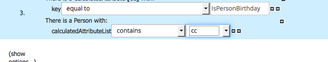

# Implementing standard price step

To implement the price table we will use a decision table. Go to the "new Item" and select the "Guided Decision Table" :

We give him a name :

And we are going to add constraint on the person age we have to add the person class type to the Data Objects list.

