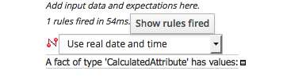
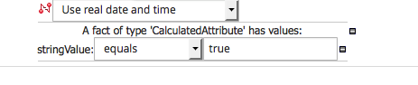

# Implementing the initial step

## Implementing the initial step

 

Then you shall obtain the rule as follows. Notice that the stringValue of the calculatedAttribute as a formula. So you should select the formula not a litteral. And also that we had to create a binding varialble "bd" for attribute birthdate of call Person.

 Notice that we test there is not already a calculated attribute for that person with the same key

Notice that we have to add to the list of calculated attribute of the person and then tell the rule engine the list was updated.

## Test the initial step

The workbench allows to test the rule we do. Create a new item of type "Test scenario" like follows :

Click on the "Given" Cross and add a new fact as follows :

Then click on the "Add Field" text.

 Select the field "quoteDate" :

Click on the "Literal value" button

As the attribute is of type date, you can select a date with the date picker.

Select a date and then add another instance of type Person

 and add a field and select birthdate.  Select literal value.

And select a date as for the quote date but on same day \(here June 30th?  then add a expectatation by clicking on the Cross near Expect 

Add a fact of type CalculatedAttribute

and Click on the "A fact of type... " Then chose the StringValue field

And then enter the value true

And as the rule we want to test is in ruleflow group init. Click on the cross near the "Given" cross and enter "init" in the activate rule flow group part.

The test scenario should then look like this :

 Then click the "Run scenario" button twice and you should see the screeen as follows 

## Calculate person age

We shall calculate the person age based on his birthday and the curDay attribute of the quote. At the same time, we shall initialize the price attribute with a BigDecimal. in the function.drl, add the "import java.math.BigDecimal"

 First add the two classes on which we shall apply the rule.  Then we should create the rule like that.

We added two options : the ruleflow group.

Then we can create a test scenario to verify our rule.

