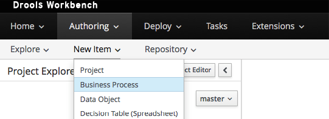
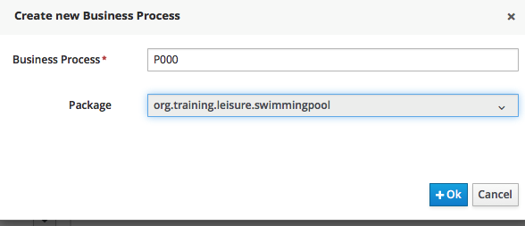
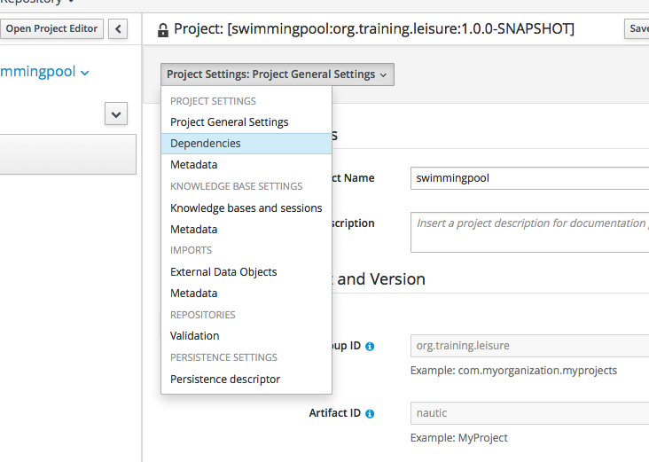
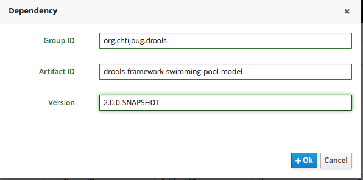
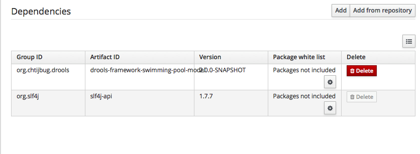

# Implementing the Process Flow

We are going to implement a rule flow with 5 steps.

| Name           | ruleflow group name |
| -------------- | ------------------- |
| init data      | init                |
| standard price | standard            |
| Promotion      | promotion           |
| Reduction      | reduction           |
| Subscription   | subscription        |

We shall give him a name in a package

Select the start event and select the task element :&#x20;

Click on the wrench and select "Business Rule Task"

Click on the "<<" on the right part and the properties will appear. Enter the Name and Ruleflow group name as follows :

Do the same with other business tasks.

And do not forget to save the process.
