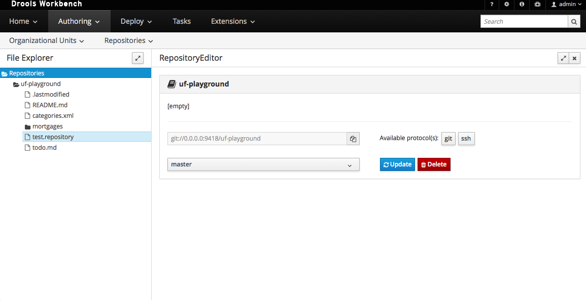
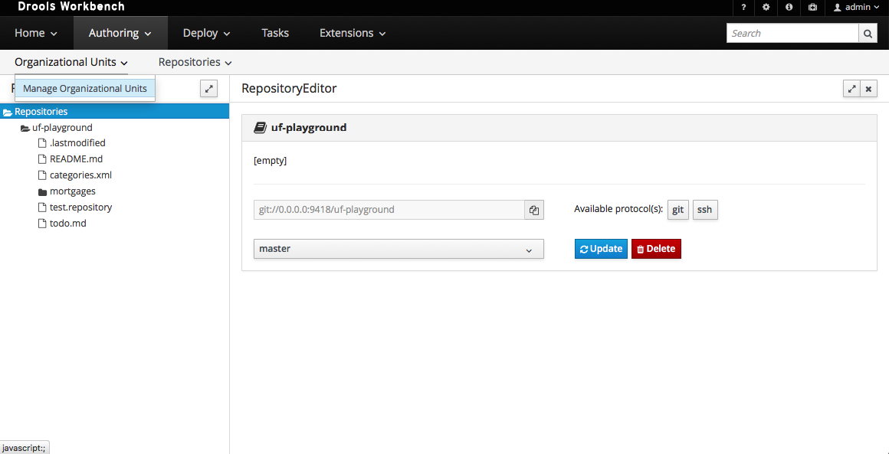
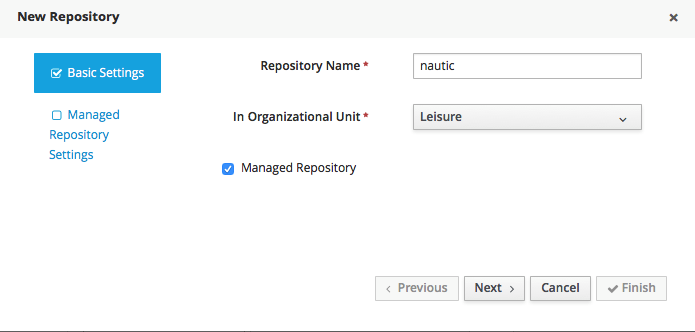
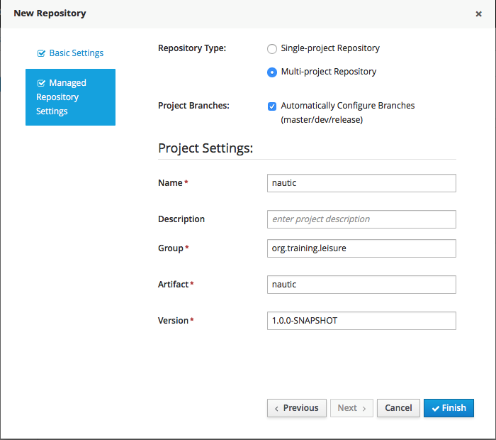
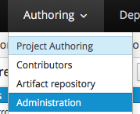
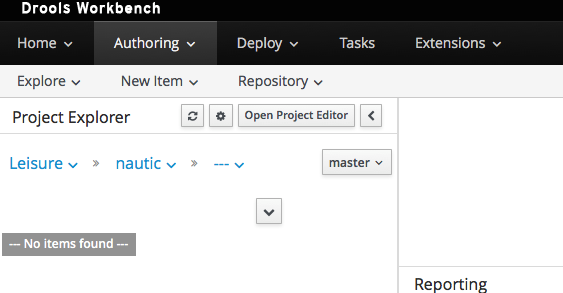

# Organizational Unit And repository

Before starting any example, we shall create the necessary wrapping. On the main screen, click the "Administration" link or the menu Authoring/Administration.

You should arrive to the next screen.

We will first create an organization Click on Organizational Unit/Manage Organizational Units

 And the click on the +Add Button in the middle and the following screen should be displayed. Enter the data as displayed here and click on the OK button.

Now we shall create a repository \(git\) for that.

We Shall give him a name a select the "Managed Repository" selector as shown below. We shall create the repository for the Organizational Unit we created before.

After clicking the "Next button" the following screen will appear. Enter as shown here. We want it to be a multi-project repository, we want to use 3 branches and give a default groupID and version. Then click on the "Finish" button.

Now go Back on the AUthoring view.

Now we are ready.

