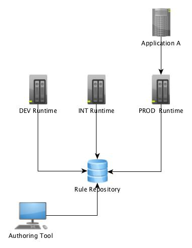

# BRMS Runtime tutorial

## Using previous drools version (5.x)

In a classical drools project in previous version, the architecture was often like this : 

* an application A is going to call and use a drools service.
* a drools runtime that is built for the application using standard drools API. In many cases the runtime is using a stateless session.&#x20;
* The drools runtime is loading the rule package from a rule repository that has an authoring tool to implement the rules. This last two features were implemented using what was called Guvnor.&#x20;
* Deploying a new version of a package could be done by updating  the runtime remotely by calling the drools API features.

An alternative of this architecture is to implement the runtime directly in the application A.

## Architecture using 6.4 version and drools API

In the 6.x serie, the Guvnor tool was replaced by what was called workbench and now Business Central. We shall call it kie-wb. It is possible to take the same architecture using the drools API and the kie-wb. There are now two possibilities

* as the business central is a maven repository, rebuild the runtime (or application if the runtime is embedded) with the new package version.
* In the runtime dynamically add to the java classpath the new jar of the rules package each time there is a new version.

## using kie-server and kie-wb together

In the 6.x version, a new component was introduced called kie-server. It wraps all we described in previous step and is integrated with the workbench. The new architecture looks like the previous one :

* Each kie-server calls the kie-wb at startup and declares itself&#x20;
* From the kie-wb, it is possible to create kie-container in the desired kie-server.&#x20;
* This kie-container contains one maven artifact defined in the kie-wb for one version.&#x20;
* All this is linked together using maven configuration and all related features but all is done for us. You just say you want this artifact in this version (it must be built before of course) and that is all.
* The kie-container exposes a basic rest service that has the same signature as the API we used in the drools tutorial : insert object, fire all rules etc..
* The application A calls the drools API remotely and does not have to take care of new rule version deployment.

Out of the box, the new drools tooling in version 6.4 offers us an authoring tool with a runtime ready to work\\/deploy a drools set of rules in a maven package.

Which is even better is that as well the authoring tool (kie-wb) or the execution server (kie-server) can be extended. You can see that at the end of the book.

For now on, we shall use the standard tooling and interface available out of the box.
