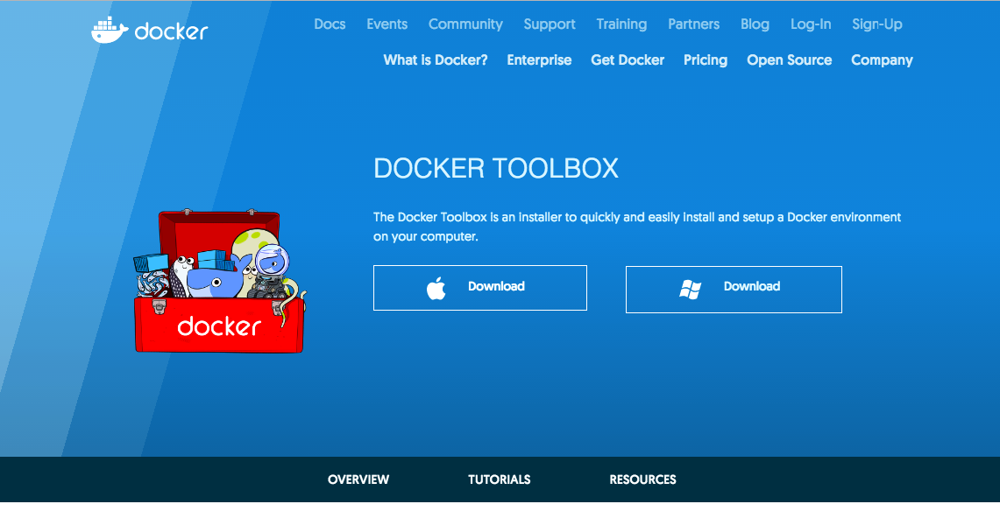
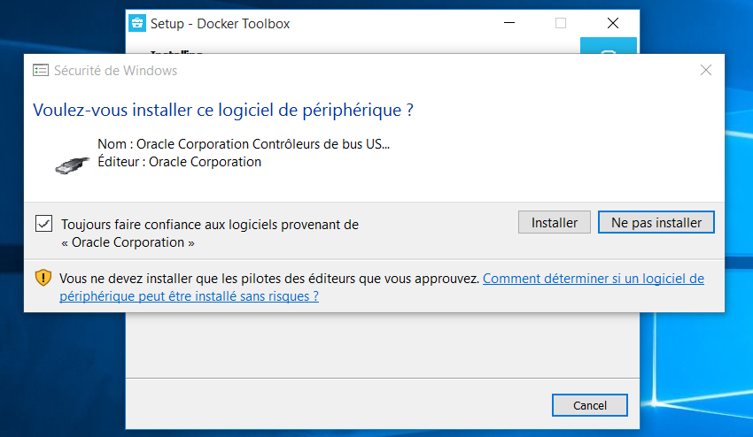
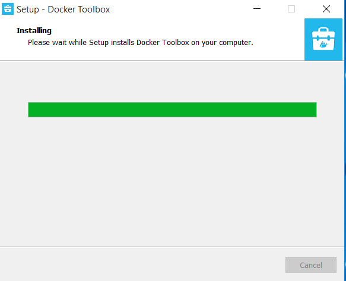
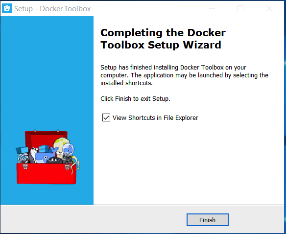
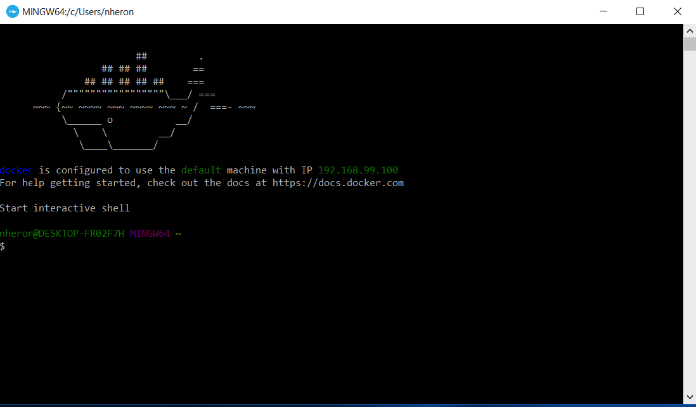
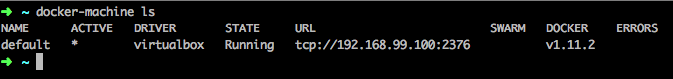
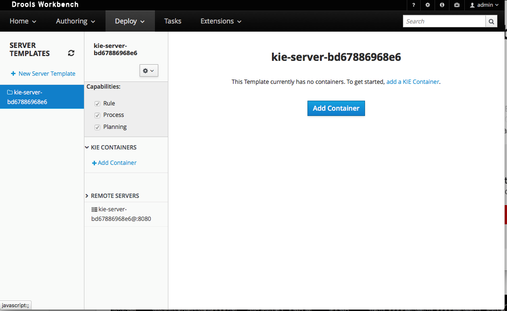

# Install needed tools to run the workbench

To be able to run the workbench as well as the kie server nativelely on your machine, a lot has to be installed :

* Java runtime
* Bundle that installs all needed component

Then you run a shell script to make all run. What if you have another version of java ?

To make it easier, we are going to use a container technology called[ docker.](https://www.docker.com)

This technology allows us to use pre-build images that run on all supported platform of docker : nearly all linux flavors, Mac Os and windows and this in native way for [windows](https://docs.docker.com/docker-for-windows/) or for [MacOS](https://docs.docker.com/docker-for-mac/). You can use this way of using but we shall use the toolbox instead.

This will avoid spolling your operating system, we are going to use virtual machines on your host.

For the windows\\/MacOS machines, the toolbox is [here.](https://www.docker.com/products/docker-toolbox)

We shall continue withe the windows installation.

Click in the download page on the Docker ToolBox Setup. The security system will ask you if you allow this program to execute, answer yes.

Now double click on the "Docker quickstart terminal" and all should start :

Now we are ready to start the workbench.

We are first going to start the workbench

type in the command line

`docker run -p 8080:8080 -p 8001:8001 -d --name drools-wb jboss/drools-workbench-showcase:6.4.0.Final`

The command may need to download the image from the docker hub.

To know if if is running, we shall connect to the drools workbench, we shall first look on which ip the docker machine is running :

We shall first verify the drools workbench is running :

you can now access the workbench at the following address : http:\\/\\/192.168.99.100:8080\\/drools-wb

the username is admin and the password is admin.

We shall now start a kie-server.

enter the command :

`docker run -p 8180:8080 -d --name kie-server --link drools-wb:kie_wb jboss/kie-server-showcase:6.4.0.Final`

Login in the workbench and go the deploy\\/rule deployment and you should see this.

You can now start the tutorial on the BRMS.
