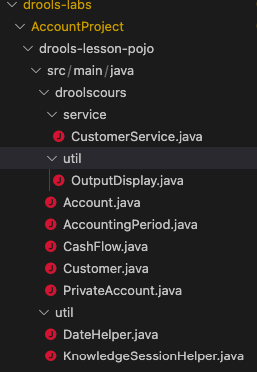

# Data Model used in the tutorial

## Data Model used in the tutorial

We are first going to write java code that we are going to use through all the drools tutorial.\
Here is the model we are going to use (taken from a presentation done during conferences by drools members)\
We are in a bank that handles accounts (2) and on each account, there can be movements (1). The purpose is to calculate the account balance between an accounting period (3) of all accounts given the movements it has.\
We will run all examples in junit Tests.\
This data model is the same as you can find in the reference model in the drools documentation.\

### Implement the POJO model

The pojo model is already implemented int he drools-lesson-pojo maven artefact.\

## Create a Helper Class

To simplify the writing of tests, we shall write a helper class. This class should be named  KnowledgeSessionHelper

This class contains all static methods to create sessions and knowledge bases for us.\
Look in the first test class how to use it.

## Create the first test case

And push the Finish Button

the code should be entered like this :

.png>)

\
Select the open class, Right-click, and run as JUnit Test :

We are now ready to start the lessons.
