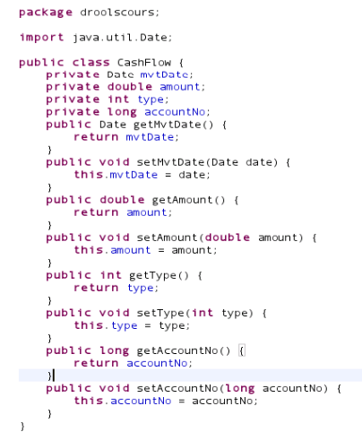
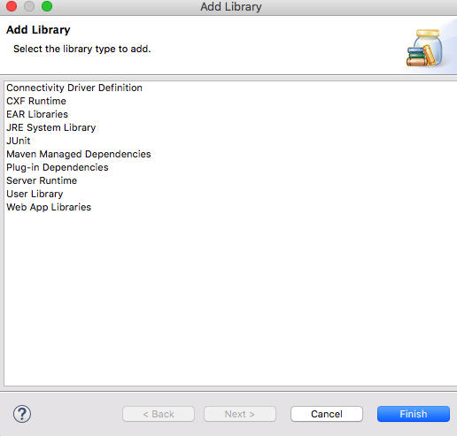
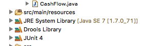
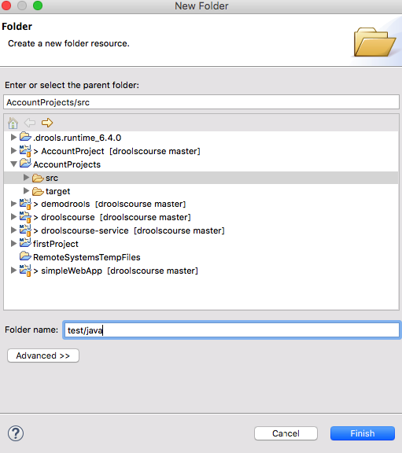
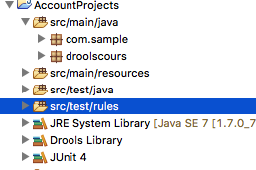
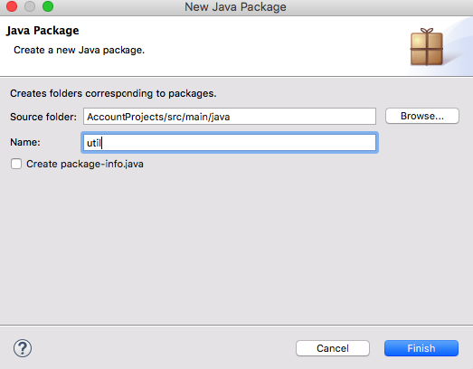
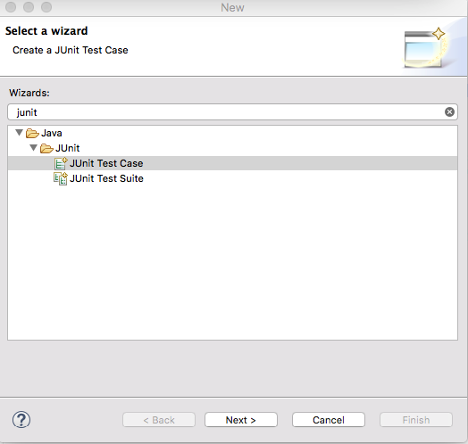
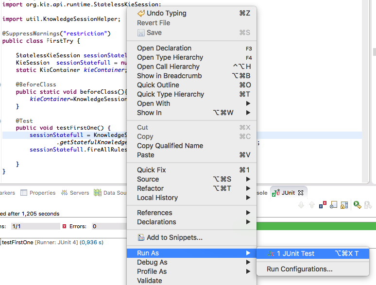

# Data Model used in the tutorial

## Data Model used in the tutorial

We are first going to write java code that we are going to use through all the drooks tutorial.  
Here is the model we are going to use \(taken from presentation done during conferences by drools members\)  
We are in a bank that handles accounts \(2\) and on each account there can be movements \(1\). The purpose is to calculate the account balance between an accounting period \(3\) of all accounts given the movements it has.  
We will run all examples in junit Tests.  
This data model is the same as you can find in the reference model in the drools documentation.  

### Implement the pojo model

We have to create an AccountProject of type drools as previously describes.  
Then we shall create a java package that we can name droolscours package in src/main/java \(to respect maven definition\) by doing on src/main/java right click and new Package, gibe him a name and push the finish button.

and we are going to create 3 java classes : Account, AccountingPeriod and CashFlow by right-clicking on the new package just created and new Class

And the Account class, add two attributes accountno and balance.  
Right click source/generate getter/setter and the Account class will have getter/setter.

  
Do the same for accounting period  

and for CashFlow

## Add JUnit library

To be able to use junit, we have to add the junit library.  
Select the project, right click and select BuildPath/Configure BuildPath

Click on the Libraries tab and select the "Add library" button.  
  
Select the Junit library and push the next button

  
On the next screen, push the Finish Button  
  
and the the Ok button

  
The Junit libray is now part of the project  

We now have to create some directory.  
Select the src directory and right click button new Directory.

  
Enter test/java in the folder name and press finish.  
Do the same but test/rules.  
The folder part should look like that :  

now Select src/test/java and right click buildpath/use as source folder

Do the same with src/test/rules  
now the project should look like this :

## Create a Helper Class

To simplify the writing of tests, we shall write a helper class.  
To do, we first create a package called util and in there create a class that we shall all KnowledgeSessionHelper

  
Then create a new class called KnowledgeSessionHelper

  
In the Class, the content should look like here  

## Create the first test case

Select the src/test/java package and Right click Other and type junit. Select Junit Test case

Push the next Button.  
In the next screen, enter droolscours as package name and FirstTry as Name

And push the Finish Button

the code should be entered like this :

  
Select the open class, Right click and run as JUnit Test :

  
And the Junit Window should appear as above. \(of course no rules were fired\).

We are now ready to start the lessons.

