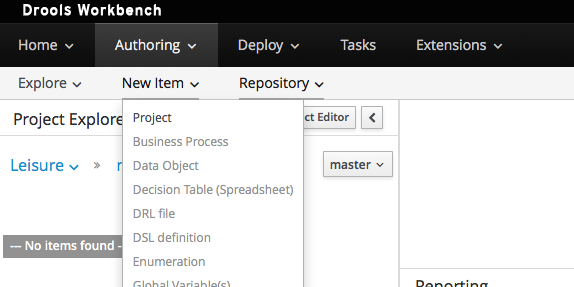
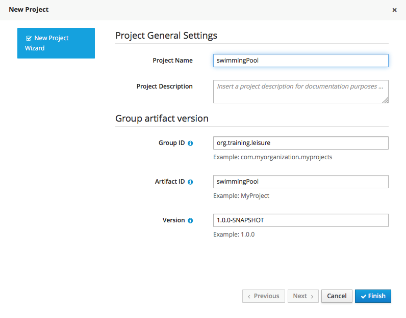
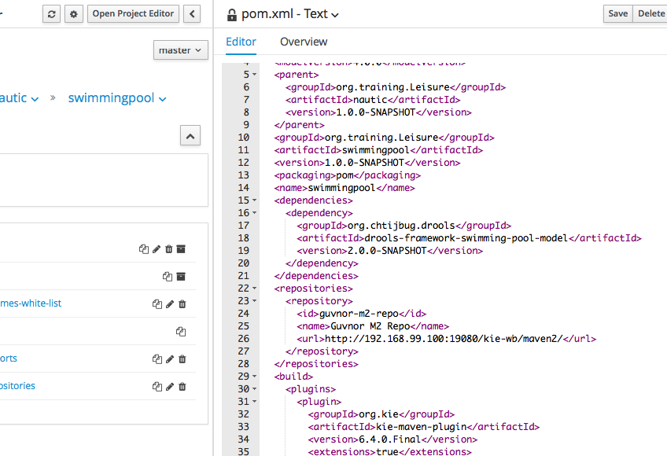

# Data Model

In the previous step we create a Organization Unit and a repository nautic.
We are now going to create project called swimmingpool.

In the New Item select "project"

Enter the data as shown above. The Project general settings view is then displayed.

We want to add a dependency on the pojo/entity java model. So we click as shown below on the "dependencies" menu item.

We then enter the data as shown below.

This is a community project we shall speak later about. Then as in our runtime we configured all necessary settings for maven, all is retrieved. The project we use is on maven central.
The following screen is then displayed.

As said in the introduction on BRMS, all dependency are shown.

> Note that in the 6.4.0 version there is a bug. If the workbench is restarted, the list is then empty when you log again. But it is only a display problem as in the repository the dependency is kept.
> the JIRA is [here](https://issues.jboss.org/browse/GUVNOR-2508).

Now we have to say which java entity/classes we want to use in our rules. This is then done as follows.

Then the list looks like this.

Here is the data model we are going to use in our tutorial : 

## Where dependencies and package white list are stored
As said before, in case of a restart of the workbench application, the dependency list is empty.
In this case, to see the dependency, you set the project explorer mode to repository view as shown below/

You can now see how the repository is stored with all files.

Click on the pom.xml file. In the dependency part of the file, you should see what we entered before.

And in the file package-names-white-list the package we defined allowed to be used in the guided editors.

