# Data Model used in the tutorial

We are first going to write Java code that we are going to use through all the drools tutorial.  
Here is the model we are going to use \(taken from presentations done during conferences by drools members\).  
We are in a bank that handles accounts \(2\) and on each account there can be movements \(1\). The purpose is to calculate the account balance between an accounting period \(3\) of all accounts given the movements it has.  
We will run all examples in junit Tests.  
This data model is the same as you can find in the reference model in the drools documentation.  
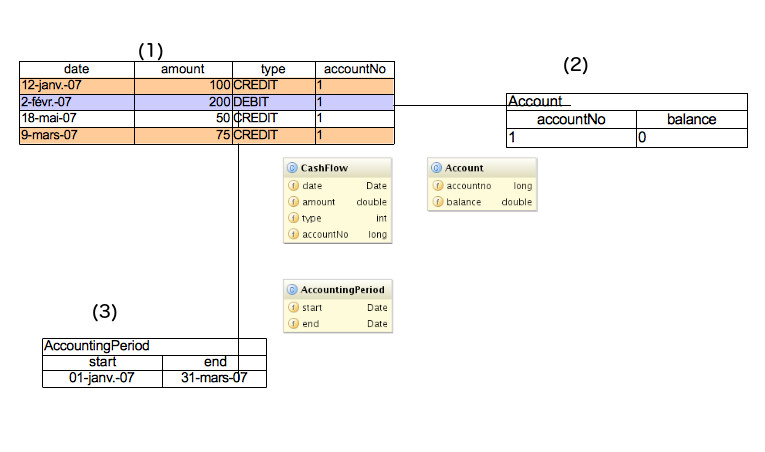

## Implement the pojo model

We have to create an AccountProject of type drools as previously described.  
Then we shall create a java package that we can name droolscourse package in src/main/java \(to respect maven definition\) by doing on src/main/java a right click and New Package, give it a name and push the Finish button.

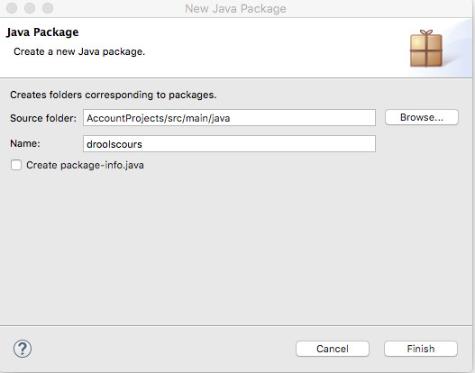

And we are going to create 3 java classes:  Account, AccountingPeriod and CashFlow by right-clicking on the new package just created and New Class.

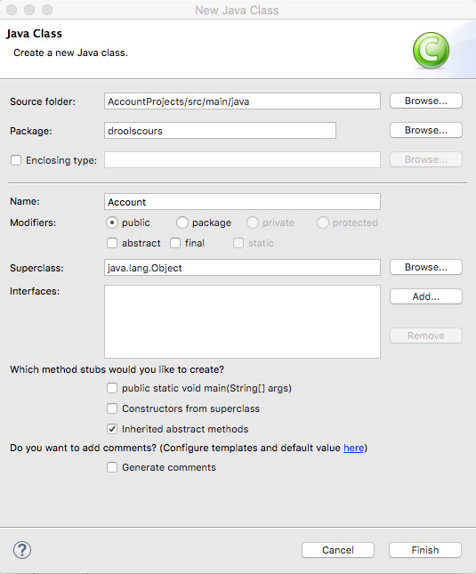

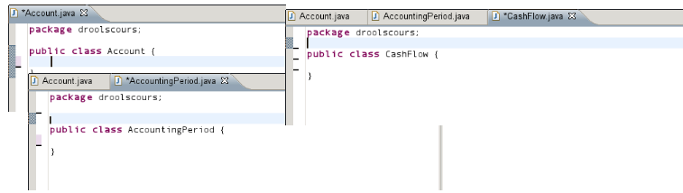

And the Account class, add two attributes accountno and balance.  
Right click source/generate getter/setter and the Account class will have getter/setter.

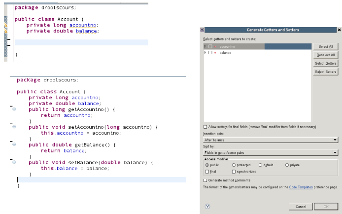  
Do the same for accounting period  
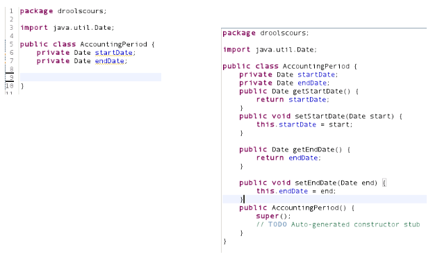

and for CashFlow

## Add JUnit library

To be able to use junit, we have to add the junit library.  
Select the project, right click and select BuildPath/Configure BuildPath

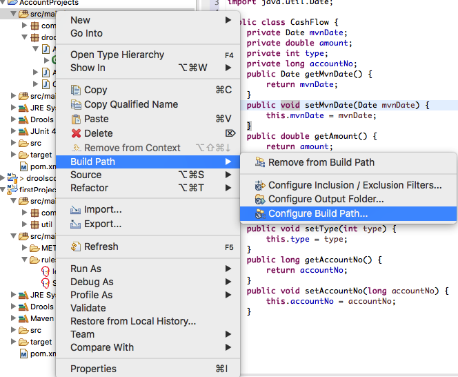

Click on the Libraries tab and select the "Add library" button.  
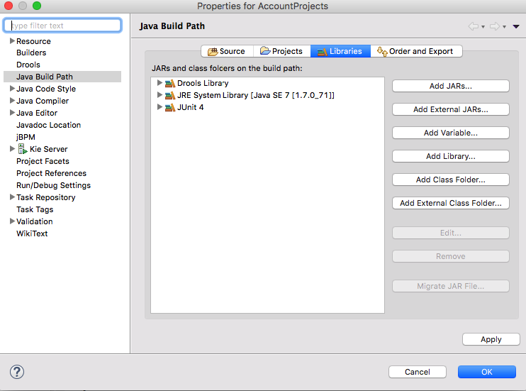  
Select the Junit library and push the Next button.

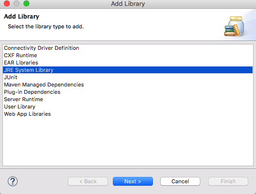  
On the next screen, push the Finish button  
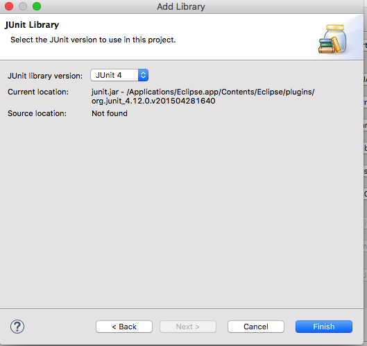  
and the the Ok button.

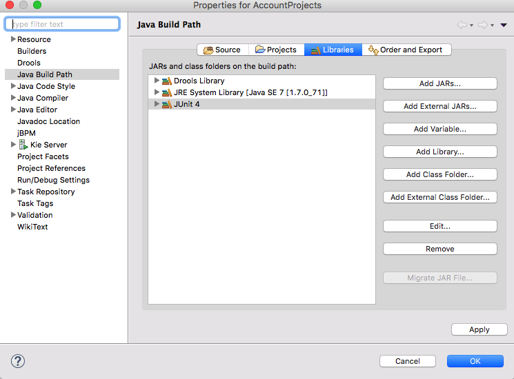  
The Junit libray is now part of the project.  

We now have to create a directory.  
Right click on the src  directory and click New Directory.

  
Enter test/java in the folder name and press Finish.  
Do the same with test/rules.  
The folder part should look like this:  

Now right click src/test/java and click Buildpath/Use as source folder.

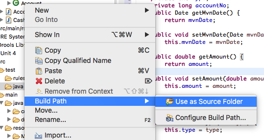

Do the same with src/test/rules and 
now the project should look like this:

## Create a Helper Class

To simplify the writing of tests, we shall write a helper class.  
To do this, we first create a package called util and in there create a class that we shall call KnowledgeSessionHelper .

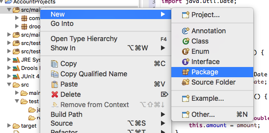

  
Then create a new class called KnowledgeSessionHelper .

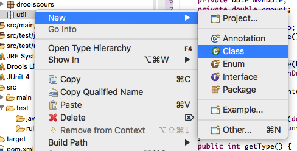

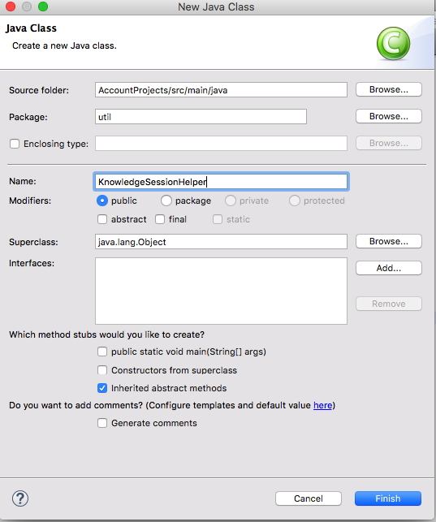  
In the class, the content should look like here  
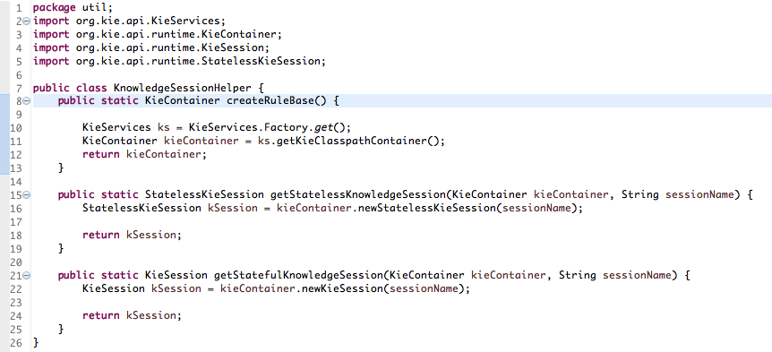

## Create the first test case

Right click the src/test/java package, click Other and type junit. Select JUnit Test Case.

Push the next Button.  
In the next screen, enter droolscourse as the package name and FirstTry as the Name.

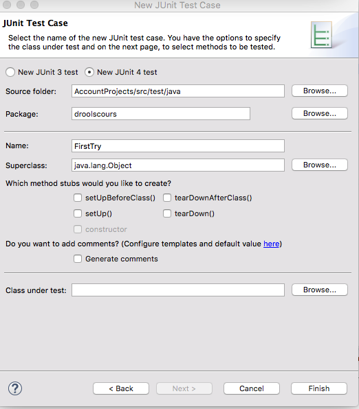

And push the Finish Button.

The code should be entered like this :

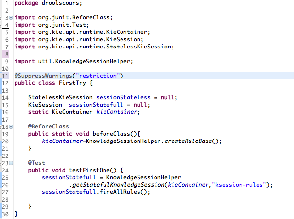  
Select the open class, right click and run as JUnit Test :

  
And the JUnit window should appear as above. \(of course no rules were fired\).

We are now ready to start the lessons.

