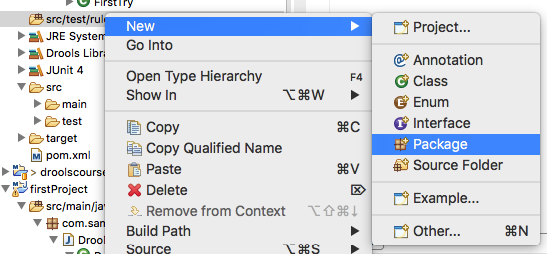
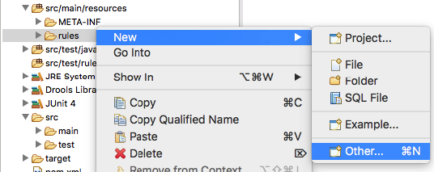
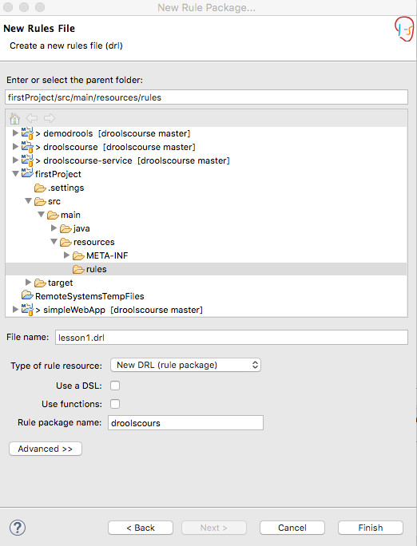
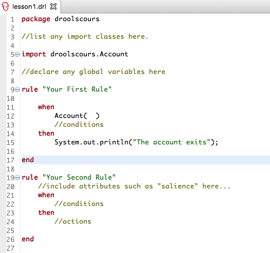
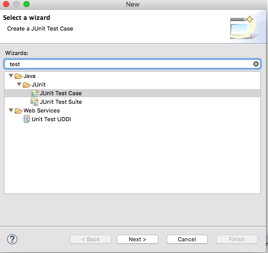

#  First Rule Language Element

## What is a rule ?
In the previously created project, we are going to add a new drl file (drl = drools rule language) 
to do so, select src/test/rules and first create a package called lesson1 and the a rule file called "lesson1".

and the select rule Drools/Rule Resource

Enter a rule name and package and press the Finish Button.

the following element is then displayed : lesson1.drl

(1) For every java object we are going to use, we need to import classes
(2) It is possible to define global variables
(3) Unique rule name 
(4) Rule conditions sometimes called LHS=Left Hand Side as it is on the left side of the RETE algorithm which is included in drools
(5) Code to execute here pure java code sometimes called RHS=Right Hand Side. 

## Adding a condition to a rule
As any plugin in eclipe, the drools plugin allows autocompletion (ctrl+space)

We create a rule the has a condition just a fact of type Account. If the rule is fired, then we shall show the message "The account exists" in the console. Notice that the then part is just pure java.

Create a junit test called "testLesson1"

And then modify the test case to obtain this

and in src/main/resources/META-INF modify kmodule.xml

