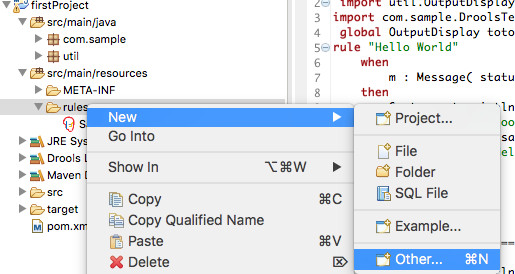
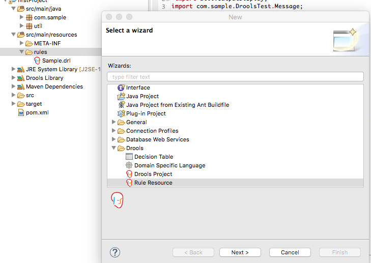

#  First Rule Language Element

## what is a rule ?
In the previously created project, we are going to add a new drl file (drl = drools rule language)
to do so, select src/main/ressources/rules and right click new/other

and the select rule Drools/Rule Resource

Enter a rule name and package and press the Finish Button.

the following element is then displayed : lesson1.drl

(1) For every java object we are going to use, we need to import classes
(2) It is possible to define global variables
(3) Unique rule name 
(4) Rule conditions sometimes called LHS=Left Hand Side as it is on the left side of the RETE algorithm which is included in drools
(5) Code to execute here pure java code sometimes called RHS=Right Hand Side. 

