#  First Rule Language Element


## What is a rule ?
In the previously created project, we are going to add a new drl file (drl = drools rule language) 
to do so, select src/test/rules and first create a package called lesson1 and the a rule file called "lesson1".


and the select rule Drools/Rule Resource


Enter a rule name and package and press the Finish Button.

the following element is then displayed : lesson1.drl


(1) For every java object we are going to use, we need to import classes
(2) It is possible to define global variables
(3) Unique rule name 
(4) Rule conditions sometimes called LHS=Left Hand Side as it is on the left side of the RETE algorithm which is included in drools
(5) Code to execute here pure java code sometimes called RHS=Right Hand Side. 

## Adding a condition to a rule
As any plugin in eclipe, the drools plugin allows autocompletion (ctrl+space)


We create a rule the has a condition just a fact of type Account. If the rule is fired, then we shall show the message "The account exists" in the console. Notice that the then part is just pure java.


Create a junit test called "testLesson1"


And then modify the test case to obtain this

and in src/main/resources/META-INF modify kmodule.xml

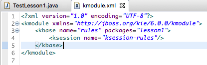
Here we defined a session called "ksession-rules" (that we use in the test to initialize the session) and where to find the rule files here in package "lesson1".
Now you can run the test in TestLesson1 and you should see this: 


It is the message that we have put in the rule "Your first rule"

Let us add some logging to facilate the output

## Using a Global variable to log informations

In the code we just did, we wrote the code System.out.println("blabla"). This is fine but imagine you want to log somewhere else, it is not possible.
One good practice is to use global variables for that purpose.
We first define a java class called OutputDisplay that we shall create in the util package in src/main/java

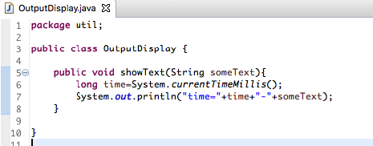
Now we shall update the lesson1.drl file

The keyword global is used and then a normal java declaration. Here the global is of type OutputDisplay and the variable is called showResults. This variable can now be used in the them part of the rule as here.
To initialize the global variable, we shall use the method setGlobal on the session we create as shown here in our test : 


When running the junit test, the console should look like this :

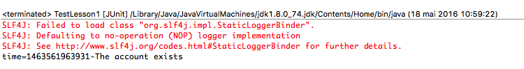
## Using callback to log activity in drools runtime

Up to known, we only defined one rule. It runs or not and if yes we added a method that shows us something to see if the rule was executed.
In bigger project, adding logging code to each rule is not a good practice and will complexify the writing of rules and furthermore we are pushing drools to be a business tool for business analyst and they have to write technical code.
Drools offers a pattern to implement that functionnality that is called session callbacks.

Drools can be viewed in a synthetic picture like this : 


- the production memory contains all the rule definition (in our case the drl for the moment)
- The working memory which created with the session and we can add facts to it with the method insert.
- The agenda which contains all the rules that can be fired.
- The pattern Matcher which is the algorithm that is used to match the rules on the facts given. In drools latest version, there are many different algorithm that are used (The main one is the rete algorithm).

On each of those parts, it is possible to add a callback when we create a Session.


Each time a fact is inserted,updated or retracted we shall log the event and show it on the console. Here we are using the toString method of the java instance given (event.getObject().toString())
You should add that part to the 

We shall add a toString method to all our pojo classes Account, AccountingPeriod and CashFlow. To do so we shall let eclipse generate it for us by right clicking in the source code 


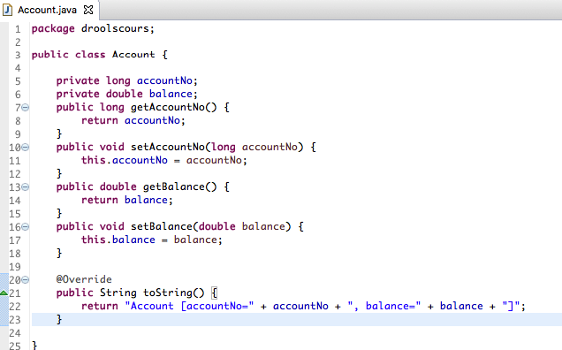
Then you should add the following unit test to the TestLesson1 java class
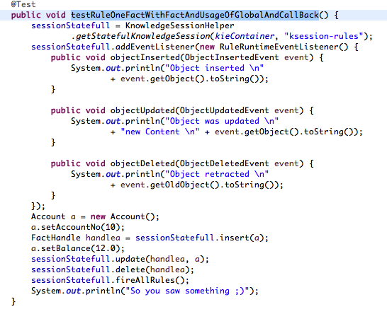
And in the console you should see this : 
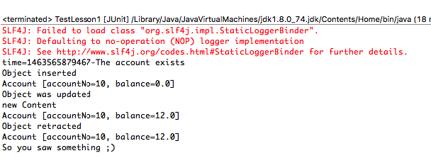
The  first line is generated by the first test. To be able to see the difference when a new test is started, we can add the following code to our JUnit test case : 

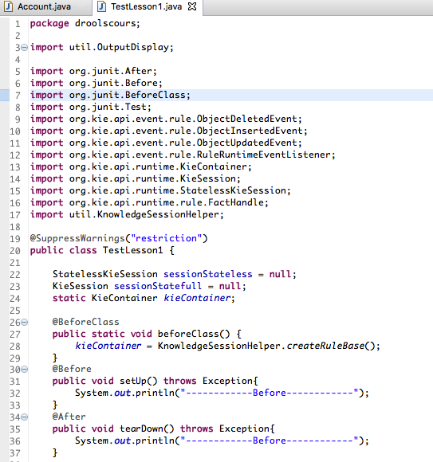
and now the console should look like this :
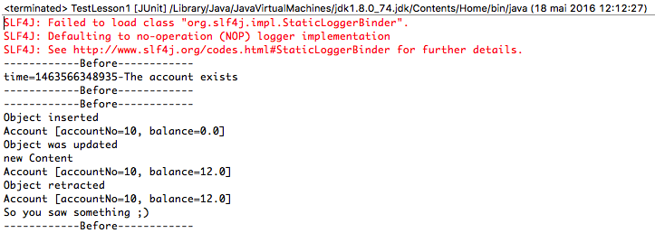
The first test is passed and we see the output generated when the rule is fired.
The second test first inserts an objet, then updates it the retract it.
To update an object, you first have to memorize the fact handle : 
```
FactHandle handlea = sessionStatefull.insert(a);
```

and then you have to use that facthandle to tell drools the object was updated :

```
   a.setBalance(12.0);
   sessionStatefull.update(handlea, a);
   ```

and the same applies when you want to retract (now called delete in drools 6) :
```
sessionStatefull.delete(handlea);
```

as we call fireAllRules() after we retract the only fact that was in the working memory, the rule "Your First Rule revisited" is not fired.
## When and how is a rule fired ?

Let us take an example : 
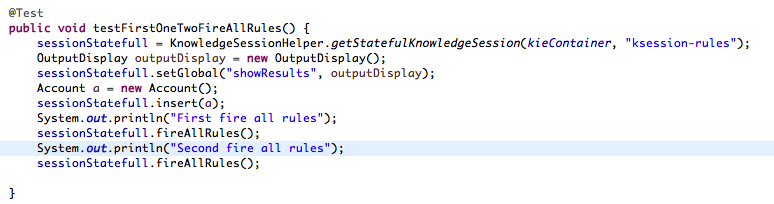
We insert an Account, call FireAllRules and then call a second time fireAllRules on the same session.
What shall happen ? How many times the rule "Your First Rule revisited" shall be fired ?

Here is the result : 

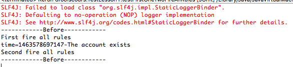
The rule is fired only once.

Let us modify the example : 

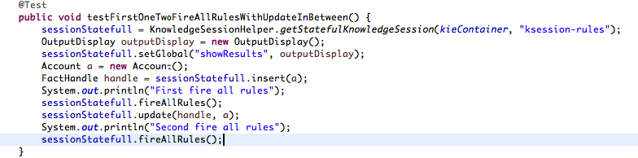
Before calling the second fireAllRules, we tell drools that the fact we inserted before was updated. 
Here is the result : 

The rule was executed a second time. 

Here is what is happening when the FireAllRules method is called on a statefull session : 
 - drools will look at all rules that can apply and put it in its agenda.
 - drools will execute the rule that is on top of its agenda
 - Once fired, the rule will be deactivated
 - We have to tell drools of a state change in one of facts in the when part (lhs) to make him reconsidering the rule.
 - A state change can be an insert, update or delete (retract).

In the last example, we tell drools that a fact has been updated 

```
sessionStatefull.update(handle, a);
```
So therefore, considering the previously inserted fact has been updated, drools reconsiders the rule. 
As in the rule "Your First Rule revisited" there are no condition on the attributes, the rule is then fired.


But we can also do that in the then (RHS) part of a rule : insert, update, retract.

Here is the test case : 
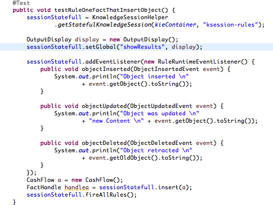

Here are the concerned rules.
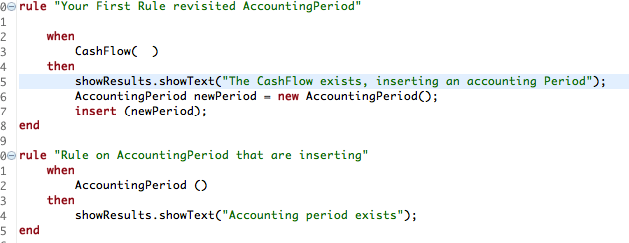
in the first rule, in the then part we create a new instance of time AccountingPeriod and we use the keyword insert to tell drools to create a new fact.
As a concequence, the second rule will be executed as the only condition is there is an AccountingPeriod in the working memory.

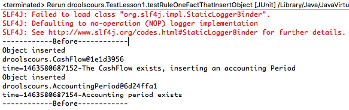
We see in the logs
- two first line : an object of type CashFlow was inserted. We did that from the Junit test with the code
```FactHandle handlea = sessionStatefull.insert(a);```

-  the third line is generated in the then part of the rule "Your First Rule revisited AccountingPeriod".
-  The fourth and fifth line : an object of type AccountingPeriod was inserted. This was done in the then part of the rule "Your First Rule revisited AccountingPeriod" 

```
AccountingPeriod newPeriod = new AccountingPeriod();
		insert (newPeriod);
        ```


