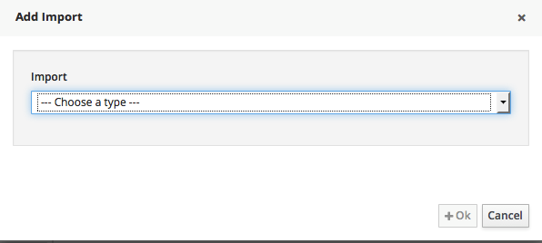
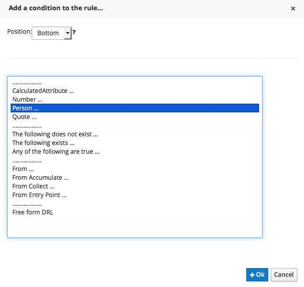
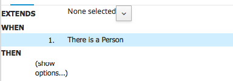
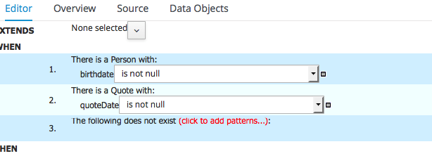

# Implementation


## Create the process flow

We are going to implement a rule flow with 5 steps.


| Name | ruleflow group name |
| -- | -- |
| init data | init |
| standard price | standard |
| Promotion | promotion |
| Reduction | reduction |
| Subscription | subscription |


We shall give him a name in a package


Select the start event and select the task element : 
[](BRMS/Step3-1-Implementation/action03.png)

Click on the wrench and select "Business Rule Task"


Clock on the "<<" on the right part and the properties will appear. Enter the Name and Ruleflow group name as follows : 


Do the same with other business tasks.


And do not forget to save the process.


## Cloning the git repository
Before going further, if you have git installed on your machine, you can checkout the code by cloning the repository  : 

```
git clone git://machine_ip:9418/nautic
```


In my example, I use a docker container that is in a virtualBox Machine at ip 192.168.99.100 and at port 19418.


## Create functions 
We will need some java functions to help us writing rules
Go to new ITems/DRL FIle and create a rule called function and put in the  rule content the following code : 


```
import java.util.Calendar;
import java.util.Date;

function int dateCalculation(Date currentDate,Date birthDate) {

   long ageInMillis = currentDate.getTime()-birthDate.getTime();
   Date age = new Date(ageInMillis);
   return (int)(ageInMillis/1000/60/60/24/365);

}

function boolean isBirthday(Date currentDate,Date birthDate){
   boolean result = false;
   Calendar c1 = Calendar.getInstance();
   c1.setTime(currentDate);
   Calendar c2 = Calendar.getInstance();
   c2.setTime(birthDate);
   int day1 = c1.get(Calendar.DAY_OF_MONTH);
   int month1 = c1.get(Calendar.MONTH);
   int day2 = c2.get(Calendar.DAY_OF_MONTH);
   int month2= c2.get(Calendar.MONTH);
   if (day1==day2 && month1==month2){
	result = true;
   }
   return result;
}


function double AgeCalculationYear(Date d1,Date d2) {
	Calendar c1 = Calendar.getInstance();
	c1.setTime(d1);
	int day1=   c1.get(Calendar.DAY_OF_MONTH);
	int month1 = c1.get(Calendar.MONTH);
	int year1 = c1.get(Calendar.YEAR);
	Calendar c2 = Calendar.getInstance();
	c2.setTime(d2);
	int day2=   c2.get(Calendar.DAY_OF_MONTH);
	int month2 = c2.get(Calendar.MONTH);
	int year2 = c2.get(Calendar.YEAR); 
	double val1= (year2-year1);
	double val2=(month2-month1)/12.0;
	double val3=(day2-day1)/365.0;
	double age = val1+val2+val3;
	return age;
}
function double AgeCalculationMonth(Date d1,Date d2) {
	Calendar c1 = Calendar.getInstance();
	c1.setTime(d1);
	int day1=   c1.get(Calendar.DAY_OF_MONTH);
	int month1 = c1.get(Calendar.MONTH);
	int year1 = c1.get(Calendar.YEAR);
	Calendar c2 = Calendar.getInstance();
	c2.setTime(d2);
	int day2=   c2.get(Calendar.DAY_OF_MONTH);
	int month2 = c2.get(Calendar.MONTH);
	int year2 = c2.get(Calendar.YEAR); 
	double val1= (year2-year1)*12;
	double val2=(month2-month1);
	double val3=(day2-day1)/30.0;
	double age = val1+val2+val3;
	return age;
}
```


## Create the initial step













## Create the decision table for the standard price


## Implement the promotion


## Implement the reduction

## 


