# Implementation


## Cloning the git repository
Before going further, if you have git installed on your machine, you can checkout the code by cloning the repository  : 

```
git clone git://machine_ip:9418/nautic
```


In my example, I use a docker container that is in a virtualBox Machine at ip 192.168.99.100 and at port 19418.


## Create functions 
We will need some java functions to help us writing rules
Go to new Items/DRL FIle and create a rule called "function" and put in the  rule content the following code : 


```
import java.util.Calendar;
import java.util.Date;

function int dateCalculation(Date currentDate,Date birthDate) {

   long ageInMillis = currentDate.getTime()-birthDate.getTime();
   Date age = new Date(ageInMillis);
   return (int)(ageInMillis/1000/60/60/24/365);

}

function boolean isBirthday(Date currentDate,Date birthDate){
   boolean result = false;
   Calendar c1 = Calendar.getInstance();
   c1.setTime(currentDate);
   Calendar c2 = Calendar.getInstance();
   c2.setTime(birthDate);
   int day1 = c1.get(Calendar.DAY_OF_MONTH);
   int month1 = c1.get(Calendar.MONTH);
   int day2 = c2.get(Calendar.DAY_OF_MONTH);
   int month2= c2.get(Calendar.MONTH);
   if (day1==day2 && month1==month2){
	result = true;
   }
   return result;
}


function double AgeCalculationYear(Date d1,Date d2) {
	Calendar c1 = Calendar.getInstance();
	c1.setTime(d1);
	int day1=   c1.get(Calendar.DAY_OF_MONTH);
	int month1 = c1.get(Calendar.MONTH);
	int year1 = c1.get(Calendar.YEAR);
	Calendar c2 = Calendar.getInstance();
	c2.setTime(d2);
	int day2=   c2.get(Calendar.DAY_OF_MONTH);
	int month2 = c2.get(Calendar.MONTH);
	int year2 = c2.get(Calendar.YEAR); 
	double val1= (year2-year1);
	double val2=(month2-month1)/12.0;
	double val3=(day2-day1)/365.0;
	double age = val1+val2+val3;
	return age;
}
function double AgeCalculationMonth(Date d1,Date d2) {
	Calendar c1 = Calendar.getInstance();
	c1.setTime(d1);
	int day1=   c1.get(Calendar.DAY_OF_MONTH);
	int month1 = c1.get(Calendar.MONTH);
	int year1 = c1.get(Calendar.YEAR);
	Calendar c2 = Calendar.getInstance();
	c2.setTime(d2);
	int day2=   c2.get(Calendar.DAY_OF_MONTH);
	int month2 = c2.get(Calendar.MONTH);
	int year2 = c2.get(Calendar.YEAR); 
	double val1= (year2-year1)*12;
	double val2=(month2-month1);
	double val3=(day2-day1)/30.0;
	double age = val1+val2+val3;
	return age;
}
```


## Create the initial step


Then you shall obtain the rule as follows. Notice that the stringValue of the calculatedAttribute as a formula. So you should select the formula not a litteral. And also that we had to create a binding varialble "bd" for attribute birthdate of call Person.


Notice that we test there is not already a calculated attribute for that person with the same key

Notice that we have to add to the list of calculated attribute of the person and then tell the rule engine the list was updated.


## Test the initial step

The workbench allows to test the rule we do.
Create a new item of type "Test scenario"  like follows : 

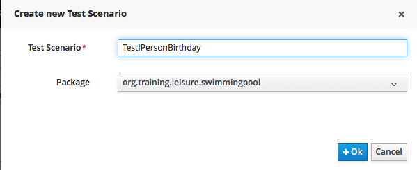


Click on the "Given" Cross  and add a new fact as follows : 


Then click on the "Add Field" text.


Select the field "quoteDate" : 


Click on the "Literal value" button


As the attribute is of type date, you can select a date with the date picker.

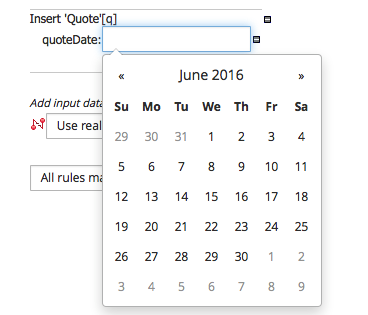

Select a date and then add another instance of type Person

 
and add a field and select birthdate.
 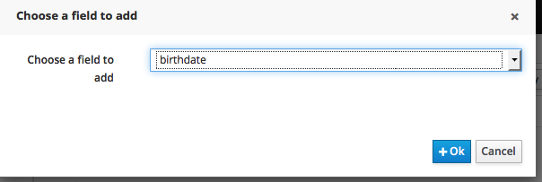
 Select literal value.

 

And select a date as for the quote date but on same day (here June 30th?
 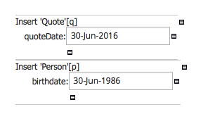
then add a expectatation by clicking on the Cross near Expect
 
 
Add a fact of type CalculatedAttribute


and Click on the "A fact of type... "
Then chose the StringValue field

 
 
 And then enter the value true
 
 
 
 And as the rule we want to test is in ruleflow group init. Click on the cross near the "Given"  cross and enter "init" in the activate rule flow group part.

 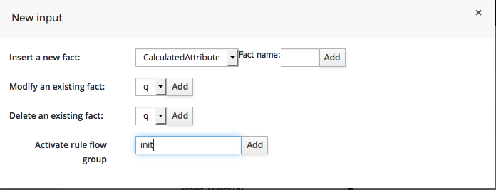


The test scenario should then look like this : 

 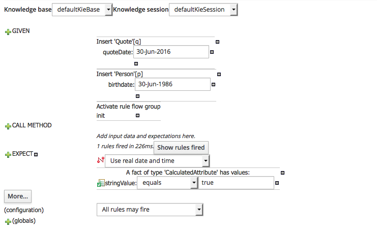
 Then click the "Run scenario" button twice and you should see the screeen as follows
 


## Calculate person age

We shall calculate the person age based on his birthday and the curDay attribute of the quote.
At the same time, we shall initialize the price attribute with a BigDecimal.
in the function.drl, add the "import java.math.BigDecimal"


First add the two classes on which we shall apply the rule.

Then we should create the rule like that.


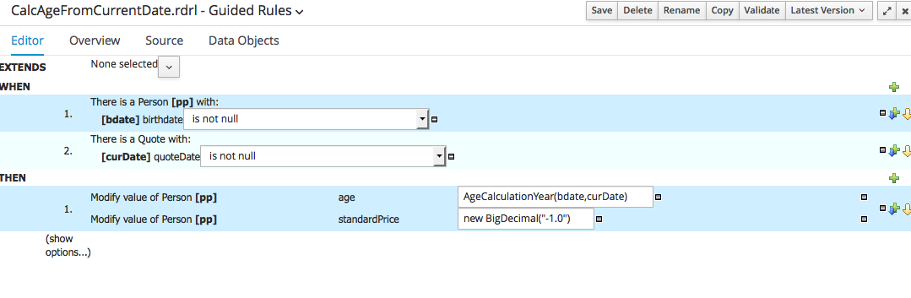

We added two options : the ruleflow group.

Then we can create a test scenario to verify our rule.


## Create the decision table for the standard price


To implement the price table we will use a decision table.
Go to the "new Item" and select the "Guided Decision Table" : 


We give him a name : 


AS we are going to add constraint on the person age


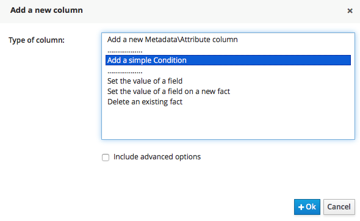


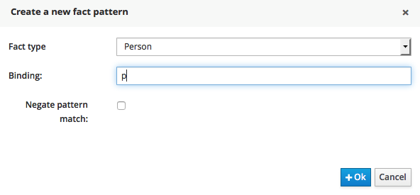


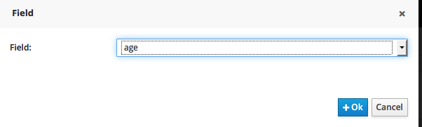


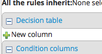


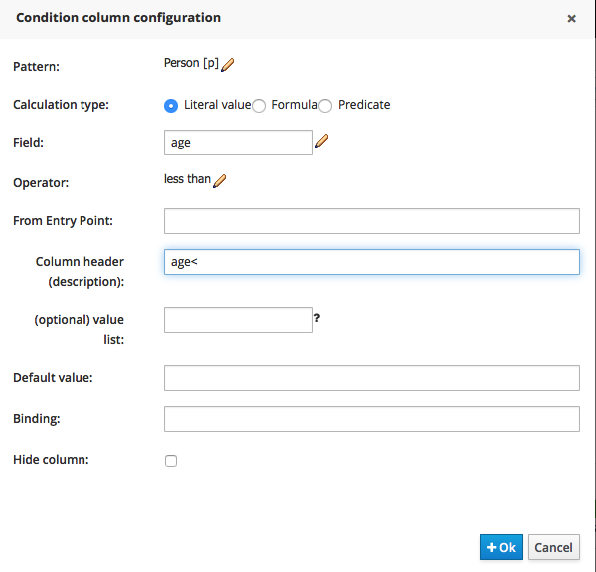


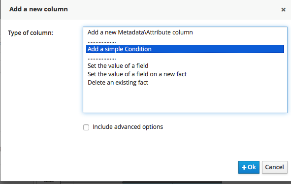

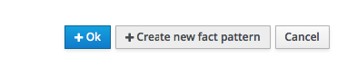

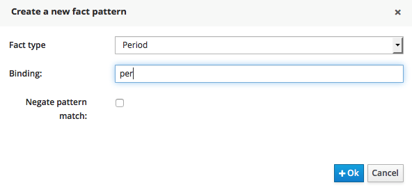


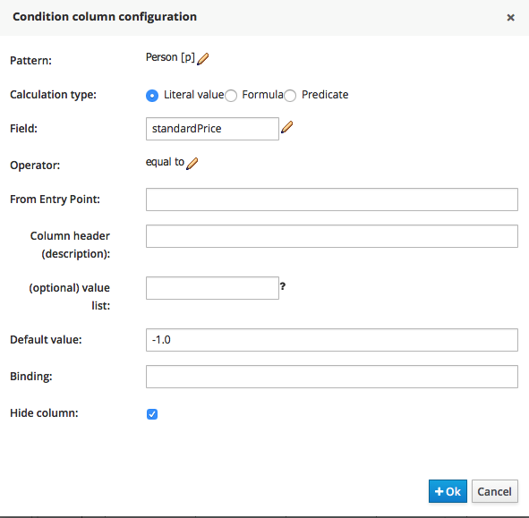


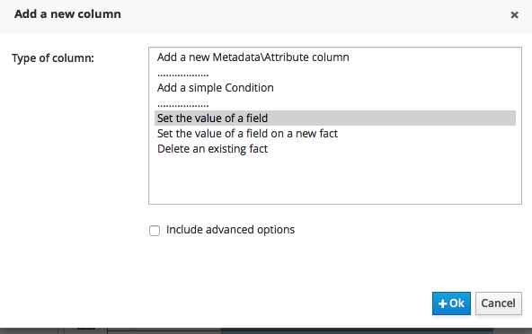


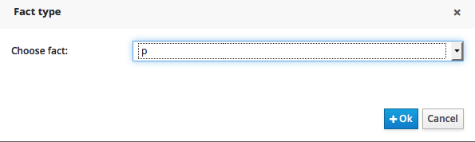

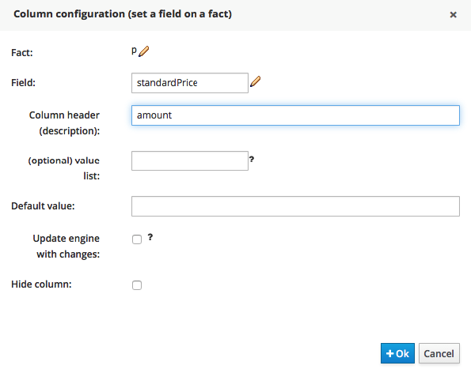


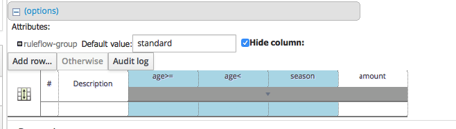


## Implement the promotion


## Implement the reduction

## 


