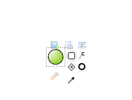
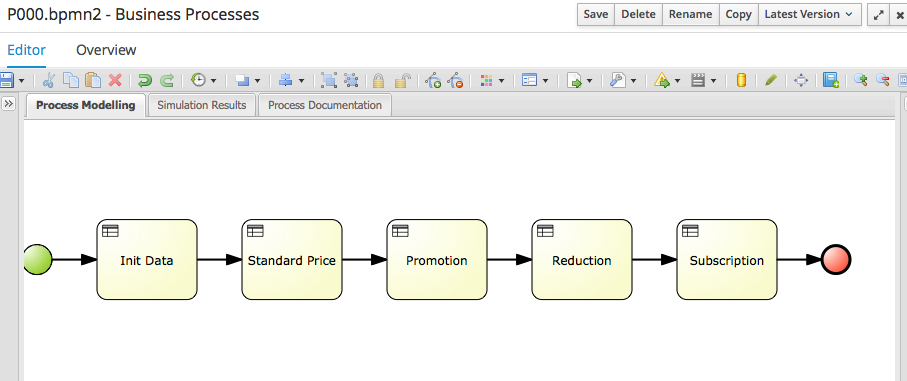

# Implementation

## Create the process flow

We are going to implement a rule flow with 5 steps.

| Name | ruleflow group name |
| -- | -- |
| init data | init |
| standard price | standard |
| Promotion | promotion |
| Reduction | reduction |
| Subscription | subscription |

