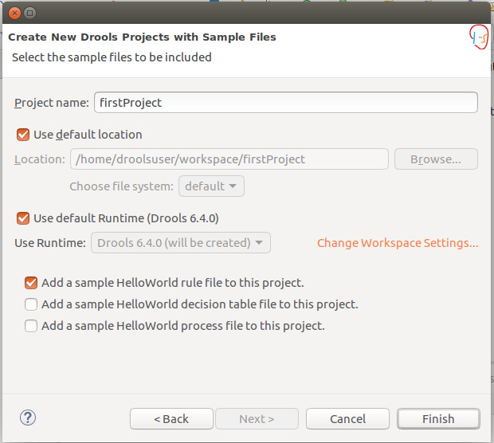
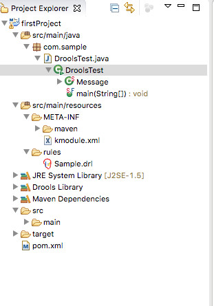

# Installing Drools Tooling

We propose a VirtualBox  Machine with all installed and configured.

If you prefer, you can install all tools on your machine.  
To be able to work with drools, we need :  
1\) Java Virtual machine version 8  
2\) Eclipse IDE  
3\) download drools runtime and tools

## Install Java Virtual Machine

Drools is working with either Oracle Java machine or OpenJDK. With the drools version we have, we can have java version 7 or 8.

## Install Eclipse IDE

After installing java, we can install [eclipse](http://www.eclipse.org/downloads/packages/eclipse-ide-java-ee-developers/mars2).

## Download drools tooling

To be able to use drools in eclipse, we need to download the [Drools and jbpm Tools](http://download.jboss.org/drools/release/6.5.0.Final/droolsjbpm-integration-distribution-6.5.0.Final.zip).

You have to unzip the file. In the directory droolsjbpm-tools-distribution-6.5.0.Final/binaries/org.drools.updatesite/ is the update site from where you have to install new Software.

## Create you first project

Go to File/New/Other  
  
then push on next  
  
Select the middle button and push next  
  
Enter "FirstProject" as a project name and keep only the "Add a sample Helloworld rule file to this project". the generated project should look like that:

If you do with the right mouse on DroolsTest class and run as "java Program", the following should be displayed on the console view

  
All is well installed.

