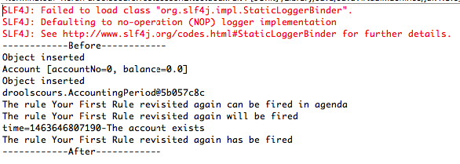
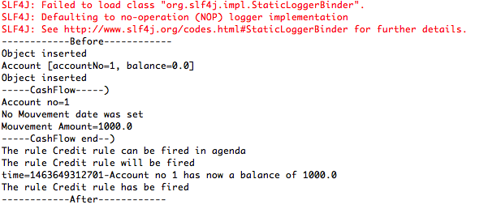
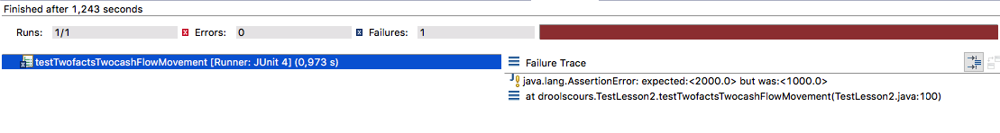
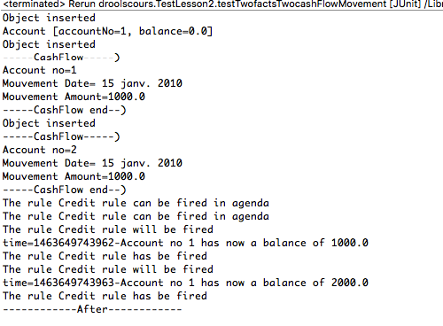
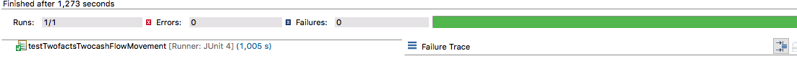

# Lesson 2 : binding
p26=> P39

## Adding callback initialization and more
To be able to see what is happening in the rule engine, we shall add to the KnowledgeSessionHelper this method

```
  public static KieSession getStatefulKnowledgeSessionWithCallback(
            KieContainer kieContainer, String sessionName) {
        KieSession session = getStatefulKnowledgeSession(kieContainer, sessionName);
        session.addEventListener(new RuleRuntimeEventListener() {
            public void objectInserted(ObjectInsertedEvent event) {
                System.out.println("Object inserted \n"
                        + event.getObject().toString());
            }
            public void objectUpdated(ObjectUpdatedEvent event) {
                System.out.println("Object was updated \n"
                        + "new Content \n" + event.getObject().toString());
            }
            public void objectDeleted(ObjectDeletedEvent event) {
                System.out.println("Object retracted \n"
                        + event.getOldObject().toString());
            }
        });
        session.addEventListener(new AgendaEventListener() {
            public void matchCreated(MatchCreatedEvent event) {
                System.out.println("The rule "
                        + event.getMatch().getRule().getName()
                        + " can be fired in agenda");
            }
            public void matchCancelled(MatchCancelledEvent event) {
                System.out.println("The rule "
                        + event.getMatch().getRule().getName()
                        + " cannot b in agenda");
            }
            public void beforeMatchFired(BeforeMatchFiredEvent event) {
                System.out.println("The rule "
                        + event.getMatch().getRule().getName()
                        + " will be fired");
            }
            public void afterMatchFired(AfterMatchFiredEvent event) {
                System.out.println("The rule "
                        + event.getMatch().getRule().getName()
                        + " has be fired");
            }
            public void agendaGroupPopped(AgendaGroupPoppedEvent event) {
            }
            public void agendaGroupPushed(AgendaGroupPushedEvent event) {
            }
            public void beforeRuleFlowGroupActivated(RuleFlowGroupActivatedEvent event) {
            }
            public void afterRuleFlowGroupActivated(RuleFlowGroupActivatedEvent event) {
            }
            public void beforeRuleFlowGroupDeactivated(RuleFlowGroupDeactivatedEvent event) {
            }
            public void afterRuleFlowGroupDeactivated(RuleFlowGroupDeactivatedEvent event) {
            }
        });
```
In the CashFlow class, we should add the following toString method
```

import java.text.DateFormat;

public class CashFlow {
	public static int CREDIT = 1;
	public static int DEBIT = 2;

	@Override
    public String toString() {
        // TODO Auto-generated method stub
        StringBuffer buff = new StringBuffer();
        buff.append("-----CashFlow-----)\n");
        buff.append("Account no=" + this.accountNo + "\n");
        if (this.mvtDate != null) {
            buff.append("Mouvement Date= "
                    + DateFormat.getDateInstance().format(this.mvtDate)
                    + "\n");
        } else {
            buff.append("No Mouvement date was set\n");
        }
        buff.append("Mouvement Amount=" + this.amount + "\n");
        buff.append("-----CashFlow end--)");
        return buff.toString();
    }
	
```

in the util package, we shall create a DateHelper class that will look like this : 


```
package util;

import java.text.SimpleDateFormat;
import java.util.Date;

public class DateHelper {
    public static String sFormat = "yyyy-MM-dd";

    public static Date getDate(String sDate) throws Exception {
        SimpleDateFormat sdf = new SimpleDateFormat(sFormat);
        return sdf.parse(sDate);
    }

    public static Date getDate(String sDate, String anotherFormat)
            throws Exception {
        SimpleDateFormat sdf = new SimpleDateFormat(anotherFormat);
        return sdf.parse(sDate);
    }
}

```

In the kmodule.xml, make it look like that
```
<?xml version="1.0" encoding="UTF-8"?>
<kmodule xmlns="http://jboss.org/kie/6.0.0/kmodule">
    <kbase name="rules" packages="lesson1">
        <ksession name="ksession-rules"/>
    </kbase>
     <kbase name="rules2" packages="lesson2">
        <ksession name="ksession-lesson2"/>
    </kbase>
</kmodule>
```

in the src/test/rules, create a package lesson2 and a rule resource named lesson2.drl and should look like this : 

```

package droolscours
//list any import classes here.
import droolscours.AccountingPeriod;
import droolscours.CashFlow;
import droolscours.Account;
import util.OutputDisplay;
global OutputDisplay showResults;

rule "Your First Rule revisited again"

    when
        Account(  )
    then
        showResults.showText("The account exists");
end


```

```
package droolscours;

import org.junit.After;
import org.junit.Before;
import org.junit.BeforeClass;
import org.junit.Test;
import org.kie.api.event.rule.ObjectDeletedEvent;
import org.kie.api.event.rule.ObjectInsertedEvent;
import org.kie.api.event.rule.ObjectUpdatedEvent;
import org.kie.api.event.rule.RuleRuntimeEventListener;
import org.kie.api.runtime.KieContainer;
import org.kie.api.runtime.KieSession;
import org.kie.api.runtime.StatelessKieSession;
import org.kie.api.runtime.rule.FactHandle;
import util.KnowledgeSessionHelper;


@SuppressWarnings("restriction")
public class TestLesson2 {
	static KieContainer kieContainer;
	StatelessKieSession sessionStateless = null;
	KieSession  sessionStatefull = null;

	@BeforeClass
	public static void beforeClass(){
		kieContainer=KnowledgeSessionHelper.createRuleBase();
	}
    
    @Before
	public void setUp() throws Exception{
		System.out.println("------------Before------------");
	}
	@After
	public void tearDown() throws Exception{
		System.out.println("------------After------------");
	}

	@Test
	public void testdeuxFait1() {
		sessionStatefull = KnowledgeSessionHelper
				.getStatefulKnowledgeSessionWithCallback(kieContainer,"ksession-lesson2");

		OutputDisplay display = new OutputDisplay();
		sessionStatefull.setGlobal("showResults", display);
		Account a = new Account();
		sessionStatefull.insert(a);
		AccountingPeriod period = new AccountingPeriod();
		sessionStatefull.insert(period);
		sessionStatefull.fireAllRules();
	}
}
    
```

To see if it runs, select the TestLesson2 class, right click and run as Junit Test and the console should look like this : 


So now we know all is working we can continue our lesson.


## Test Case 
We are going to implement a test case with the following data : 
1) Account with accountno=1
2) an Accounting period going from January first 2016 to march 31th 2016
3) 3 Cash Flow movements, credit 1000$ January 15th 2016, debit 500$ February 15th 2016 and a credit movement April 15th 2016 of 1000$.

The result should be a balance of 500$ for the accounting period.

## Fact binding
We want to update the account balance for each CashFlow.
We first put the CashFlow and select all CashFlow of type CREDIT.
To do so, we add a constraint on the type attribute of java class CashFlow.

Then we add a second constraint of type Account.
The question is now how in the then part do the balance update.
It is where the fact binding comes in : 

```
package droolscours
//list any import classes here.
import droolscours.AccountingPeriod;
import droolscours.CashFlow;
import droolscours.Account;
import util.OutputDisplay;

global OutputDisplay showResults;

rule "Credit rule"
   
	when
   		$cash :CashFlow(type == CashFlow.CREDIT )
   		$acc : Account(  )
   	then
   		$acc.setBalance($acc.getBalance()+$cash.getAmount());
   		showResults.showText("Account no "+$acc.getAccountNo()+ " has now a balance of "+$acc.getBalance());
end

```


In front of the fact, we declare variables $cash and $acc like shown above and then those variables can be used in the then part as normal java variables.
As shown above we can then update the balance.

```
package droolscours;

import util.OutputDisplay;

import org.junit.After;
import org.junit.Before;
import org.junit.BeforeClass;
import org.junit.Test;
import org.kie.api.runtime.KieContainer;
import org.kie.api.runtime.KieSession;
import org.kie.api.runtime.StatelessKieSession;

import org.junit.Assert;
import util.DateHelper;
import util.KnowledgeSessionHelper;


@SuppressWarnings("restriction")
public class TestLesson2 {
	static KieContainer kieContainer;
	StatelessKieSession sessionStateless = null;
	KieSession  sessionStatefull = null;

	@BeforeClass
	public static void beforeClass(){
		kieContainer=KnowledgeSessionHelper.createRuleBase();
	}
	@Before
	public void setUp() throws Exception{
		System.out.println("------------Before------------");
	}
	@After
	public void tearDown() throws Exception{
		System.out.println("------------After------------");
	}

	@Test
	public void testTwoFacts() {
		 sessionStatefull = KnowledgeSessionHelper
	                .getStatefulKnowledgeSessionWithCallback(kieContainer,"ksession-lesson2");
	        OutputDisplay display = new OutputDisplay();
	        sessionStatefull.setGlobal("showResults", display);
	        Account a = new Account();
	        a.setAccountNo(1);
	        a.setBalance(0);
	        sessionStatefull.insert(a);
	        CashFlow cash1 = new CashFlow();
	        cash1.setAccountNo(1);
	        cash1.setAmount(1000);
	        cash1.setType(CashFlow.CREDIT);
	        sessionStatefull.insert(cash1);
	        sessionStatefull.fireAllRules();	        
	        Assert.assertEquals(a.getBalance(), 1000,0);
        
	}
}	
```
In the TestTwoFacts test we insert an object of type Account and CashFlow mouvement of type credit. At the end, the balance should be 1000$.
the console should look like this when running the test : 




## Attribute binding

Let us make now an example with a second CashFlow movement. Here is the test case : 

```
    @Test
    public void testTwofactsTwocashFlowMovement() throws Exception {
        sessionStatefull = KnowledgeSessionHelper
                .getStatefulKnowledgeSessionWithCallback(kieContainer,"ksession-lesson2");
        OutputDisplay display = new OutputDisplay();
        sessionStatefull.setGlobal("showResults", display);
        Account a = new Account();
        a.setAccountNo(1);
        a.setBalance(0);
        sessionStatefull.insert(a);
        CashFlow cash1 = new CashFlow();
        cash1.setAccountNo(1);
        cash1.setAmount(1000);
        cash1.setMvtDate(DateHelper.getDate("2010-01-15"));
        cash1.setType(CashFlow.CREDIT);
        sessionStatefull.insert(cash1);
        CashFlow cash2 = new CashFlow();
        cash2.setAccountNo(2);
        cash2.setAmount(1000);
        cash2.setMvtDate(DateHelper.getDate("2010-01-15"));
        cash2.setType(CashFlow.CREDIT);
        sessionStatefull.insert(cash2);
        sessionStatefull.fireAllRules();
        Assert.assertEquals(a.getBalance(), 1000,0);
    }

```
When we run the test case, the test fails : 

and in the console, we see that the rule "Credit rule" is running twice : 


The rule was fired twice because there are 2 (CashFlow,Account) couples. The first CashFlow mouvement concerns account number 1 and the seconde account number 2. We need to find a way to link the two facts.
We shall modify the rule like this : 

```
package droolscours
//list any import classes here.
import droolscours.AccountingPeriod;
import droolscours.CashFlow;
import droolscours.Account;
import util.OutputDisplay;

global OutputDisplay showResults;
rule "Credit rule"
	when
   		$cash :CashFlow($accno : accountNo ,type == CashFlow.CREDIT )
   		$acc : Account( accountNo ==$accno )
   	then
   		$acc.setBalance($acc.getBalance()+$cash.getAmount());
   		showResults.showText("Account no "+$acc.getAccountNo()+ " has now a balance of "+$acc.getBalance());
end

```
The rule above uses a binding variable. We create an attribute variable called $accno on the attribute accountNo. We can define now a binding on the attribute accountNo of fact Account.





Now the rule "Credit Rule" is only fired once and the balance is corret.

## Calculating balance
Now we know how to link facts and use attribute variable via binding attributes to use them as constraint, we shall modify the credit rule and create a debit rule : 


```
package cours


import droolscours.Account;
import droolscours.AccountingPeriod;
import droolscours.CashFlow;
import droolscours.util.OutputDisplay;

global OutputDisplay showResult;

rule "Credit rule"

   	when
   		$cash :CashFlow( $aDate : mvtDate, $no : accountNo ,type == CashFlow.CREDIT )
   		$acc : Account(accountNo ==$no  )
   		$period : AccountingPeriod(  startDate <= $aDate && endDate >= $aDate)
   	then
   		$acc.setBalance($acc.getBalance()+$cash.getAmount());
   		showResults.showText("Account no "+$acc.getAccountNo()+ " has now a balance of "+$acc.getBalance());
   end
rule "Debit rule"

	when
		$cash :CashFlow( $aDate : mvtDate, $no : accountNo ,type == CashFlow.DEBIT )
		$acc : Account(accountNo ==$no  )
		$period : AccountingPeriod(  startDate <= $aDate && endDate >= $aDate)
	then
		$acc.setBalance($acc.getBalance()-$cash.getAmount());
		showResults.showText("Account no "+$acc.getAccountNo()+ " has now a balance of "+$acc.getBalance());
end
```


