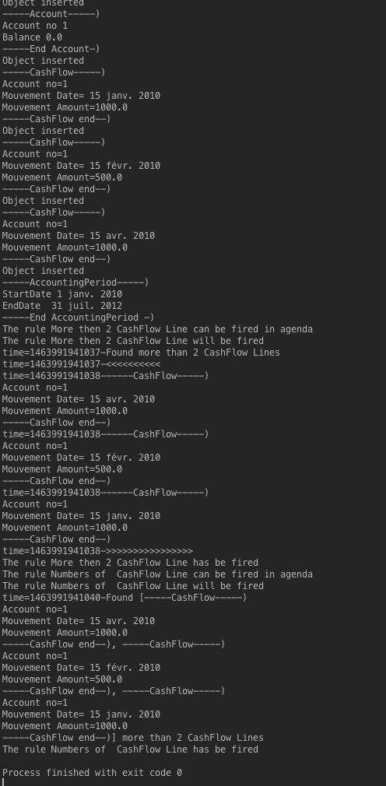

# Adding more constraints in facts

We concentrate on how the rule engine works in the first lesson. In the second lesson, we introduced how to express constraint between facts.
In this lesson, we will concentrate on all the drools language possibilities to write constraints on facts for more complex cases.
The reader has to create a test classes called TestLesson3 like for lesson2, a new package lesson3 in the src/test/rules and add in the kmodule.xml a new session declaration

```
     <kbase name="rules3" packages="lesson3">
        <ksession name="ksession-lesson3"/>
    </kbase>

```


## Some more classes
To be able to see some more advanced features, we are goig to add 2 new classes in src/main/java droolscours package.

```
package droolscours;

public class Customer {
    private String name;
    private String surname;
    private String country;

    public Customer(String name, String surname, String country) {
        super();
        this.name = name;
        this.surname = surname;
        this.country = country;
    }

    public Customer() {
        super();
        // TODO Auto-generated constructor stub
    }

    public String getCountry() {
        return country;
    }

    public void setCountry(String country) {
        this.country = country;
    }

    public String getName() {
        return name;
    }

    public void setName(String name) {
        this.name = name;
    }

    public String getSurname() {
        return surname;
    }

    public void setSurname(String surname) {
        this.surname = surname;
    }

    @Override
    public String toString() {
        StringBuffer buff = new StringBuffer();
        buff.append("-----Customer-----)\n");
        buff.append("Name=" + this.name + "\n");
        buff.append("Surname Name=" + this.surname + "\n");
        buff.append("Country=" + this.country + "\n");
        buff.append("-----Customer end-)");
        return buff.toString();
    }

}
```

```
package droolscours;

public class PrivateAccount extends Account {
    private Customer owner;

    public Customer getOwner() {
        return owner;
    }

    public void setOwner(Customer owner) {
        this.owner = owner;
    }

    @Override
    public String toString() {
        StringBuffer buff = new StringBuffer();
        buff.append("-----Private Account-)");
        buff.append(super.toString());
        if (this.owner != null) {
            buff.append(this.owner.toString());
        }
        buff.append("-----Private Account end-)");
        return buff.toString();
    }
}

```


## In Constraint
This allows to validate an attribute is a list of values

```
package cours

//#list any import classes here.
import droolscours.CashFlow;
import util.OutputDisplay;
//#declare any global variables here
global OutputDisplay showResult;

rule "The cashFlow can be a  credit or a debit"

	when
		$cash :CashFlow(type in ( CashFlow.DEBIT,CashFlow.CREDIT) )

	then
		showResult.showText("The cashFlow is a credit or a debit");
end
```

```
    @Test
    public void testInConstrait() throws Exception {
        sessionStatefull = KnowledgeSessionHelper
                .getStatefulKnowledgeSessionWithCallback(kieContainer, "ksession-lesson3");
        OutputDisplay display = new OutputDisplay();
        sessionStatefull.setGlobal("showResult", display);
        CashFlow cashFlow = new CashFlow();
        cashFlow.setType(CashFlow.CREDIT);
        sessionStatefull.insert(cashFlow);
        sessionStatefull.fireAllRules();
    }    }
```
And the console should look as follows : 


## Nested Accessor

This allows to add a constraint to a attribute class without the need to add the linked object to the session.

```
rule "Accessor"
	when
		$cash :PrivateAccount( owner.name =="Héron" )
	then
		showResult.showText("Account is owned by Héron");
end
```

```
    @Test
    public void testNestedAccessor() throws Exception {
        sessionStatefull = KnowledgeSessionHelper
                .getStatefulKnowledgeSessionWithCallback(kieContainer, "ksession-lesson3");
        OutputDisplay display = new OutputDisplay();
        sessionStatefull.setGlobal("showResult", display);
        Customer customer = new Customer();
        customer.setName("Héron");
        customer.setSurname("Nicolas");
        PrivateAccount pAccount = new PrivateAccount();
        pAccount.setOwner(customer);
        sessionStatefull.insert(pAccount);
        sessionStatefull.fireAllRules();
    }
```
As seen here, we do not add the customer instance to the drools session.


The rule has been fired.


## And/or
It is possible to do constraints on attribute like in java.
```
rule "infixAnd"
	when
	  ( $c1 : Customer ( country=="GB") and  PrivateAccount(  owner==$c1))
		    or
       ( $c1 : Customer (country=="US") and PrivateAccount(  owner==$c1))
	then
		showResult.showText("Person lives in GB or US");
end
```
```
   @Test
    public void testInOrFact() throws Exception {
        sessionStatefull = KnowledgeSessionHelper
                .getStatefulKnowledgeSessionWithCallback(kieContainer, "ksession-lesson3");
        OutputDisplay display = new OutputDisplay();
        sessionStatefull.setGlobal("showResult", display);
        Customer customer = new Customer();

        customer.setCountry("GB");
        sessionStatefull.insert(customer);
        PrivateAccount pAccount = new PrivateAccount();
        pAccount.setOwner(customer);
        sessionStatefull.insert(pAccount);
        sessionStatefull.fireAllRules();
    }
```


## not

This allows to test if no fact of a type is in the session.

```
rule "no customer"
	when
		not Customer(  )
	then
		showResult.showText("No customer");
end

```


```
    @Test
    public void testNotCondition() throws Exception {
        sessionStatefull = KnowledgeSessionHelper
                .getStatefulKnowledgeSessionWithCallback(kieContainer, "ksession-lesson3");
        OutputDisplay display = new OutputDisplay();
        sessionStatefull.setGlobal("showResult", display);
        sessionStatefull.fireAllRules();
    }
```


## exist
On the contrary of previous syntax, this allows to test if there at least one fact type is in the session.
```
rule "Exists"
	when
		exists Account(  )
	then
		showResult.showText("Account exists");
end
```
```
    @Test
    public void testExistsCondition() throws Exception {
        sessionStatefull = KnowledgeSessionHelper
                .getStatefulKnowledgeSessionWithCallback(kieContainer, "ksession-lesson3");
        OutputDisplay display = new OutputDisplay();
        sessionStatefull.setGlobal("showResult", display);
        Account pAccount = new Account();
        sessionStatefull.insert(pAccount);
        Customer c = new Customer();
        sessionStatefull.insert(c);
        sessionStatefull.fireAllRules();
    }
```


## ForAll

We would like to verify that every cashflow instance is linked to an Account instance.

```
rule "ForAll"
	when
		forall (   Account( $no : accountNo  )
					CashFlow( accountNo  == $no)
				   )
	then
		showResult.showText("All cashflows are related to an Account ");
end

```
In this rule, in the forall condition, we link the CashFLow instance to the Account instance.
We are goint to do a test case where all objects are related

```
	@Test
	public void testForALl() throws Exception {
		sessionStatefull = KnowledgeSessionHelper
				.getStatefulKnowledgeSessionWithCallback(kieContainer, "ksession-lesson3");
		OutputDisplay display = new OutputDisplay();
		sessionStatefull.setGlobal("showResult", display);
		Account a = new Account();
		a.setAccountNo(1);
		a.setBalance(0);
		sessionStatefull.insert(a);
		CashFlow cash1 = new CashFlow();
		cash1.setAccountNo(1);
	
		
		sessionStatefull.insert(cash1);
		CashFlow cash2 = new CashFlow();
		cash2.setAccountNo(1);
		
		sessionStatefull.insert(cash2);
		Account a2 = new Account();
		a2.setAccountNo(2);
		a2.setBalance(0);
		sessionStatefull.insert(a2);
		CashFlow cash3 = new CashFlow();
		cash3.setAccountNo(2);
		sessionStatefull.insert(cash3);
		sessionStatefull.fireAllRules();
	}


```
When running the test, you should see the following logging.


Just modify the test case by updating the test case : 

```
sessionStatefull.insert(cash2);
		Account a2 = new Account();
		a2.setAccountNo(2);
		a2.setBalance(0);
		sessionStatefull.insert(a2);
		CashFlow cash3 = new CashFlow();
		cash3.setAccountNo(1);
		sessionStatefull.insert(cash3);
		sessionStatefull.fireAllRules();
```
When you run the test case, the rule ForAll will not be fired.


## From
It is sometimes needed to access data from outside the drools session.
As it is not possible to insert all objects in the session, we can use the from instruction in the when part.

First let us create a CustomerService class in package Droolscours.sercice

```
package droolscours.service;

import droolscours.Customer;

import java.util.ArrayList;
import java.util.List;

public class CustomerService {

    public List<Customer> getListCustomer() {
        List<Customer> result = new ArrayList<Customer>();
        result.add(new Customer("Héron", "Nicolas", "Fr"));
        result.add(new Customer("Héron", "James", "GB"));
        result.add(new Customer("Héron", "Nicolas", "GB"));
        return result;
    }

}

```

then we shall create the rule that uses the from 

```
rule "FromCondition"
	when
		$c : Customer()
		$cc : Customer(name ==$c.name,surname==$c.surname,country !=$c.country) from serviceCustomer.getListCustomer();
	then
		showResult.showText("Found same customer in 2 countries");
end
```


and the following test case : 

```
	@Test
	public void testFromLHS() throws Exception {
		sessionStatefull = KnowledgeSessionHelper.getStatefulKnowledgeSessionWithCallback(kieContainer,
				"ksession-lesson3");
		OutputDisplay display = new OutputDisplay();
		sessionStatefull.setGlobal("showResult", display);
		sessionStatefull.setGlobal("serviceCustomer", new CustomerService());
		Customer c = new Customer("Héron", "Nicolas", "A");
		sessionStatefull.insert(c);
		sessionStatefull.fireAllRules();
	}

```

The rule is fired twice as in the service there are two customers with the same name and with a different country.


## Collecting 


the purpose is to collect a set of fact and constraint if the constraints are true.
Let us see the following example int the rule "More then 2 CashFlow Line". in this rule, we want to collect all CashFlow that are in the correct time period and the good account number.
The "from collect" syntax returns an arrayList. It is possible to add a condition as in the first rule where we add a constraint that we expect at least 2 items. In the second rule, we do not add this constraint.

```
rule "More then 2 CashFlow Line"
	when
		$c : Account( $acc : accountno )
		$p : AccountingPeriod ($sDate : startDate ,$eDate : endDate )
		$number : ArrayList(size >= 2 )
              from collect( CashFlow( mvtDate >= $sDate && mvtDate  <= $eDate,accountNo == $acc ) )

	then
		showResult.showText("Found more than 2 CashFlow Lines");
		showResult.showText("<<<<<<<<<<");
		for (Object ff : $number){
		    showResult.showText(ff.toString());
		}
		showResult.showText(">>>>>>>>>>>>>>>>");
end

rule "Numbers of  CashFlow Line"
	when
		$c : Account( $acc : accountno )
		$p : AccountingPeriod ($sDate : startDate ,$eDate : endDate )
		$number : ArrayList( )
              from collect( CashFlow( mvtDate >= $sDate && mvtDate  <= $eDate,accountNo == $acc ) )

	then
		showResult.showText("Found "+$number+" more than 2 CashFlow Lines");
end

```
Here is our test case.
```
	@Test
	public void testCollecting() throws Exception {
		sessionStatefull = KnowledgeSessionHelper.getStatefulKnowledgeSessionWithCallback(kieContainer,
				"lesson34-session");
		OutputDisplay display = new OutputDisplay();
		sessionStatefull.setGlobal("showResult", display);
		Account a = new Account();
		a.setAccountNo(1);
		a.setBalance(0);
		sessionStatefull.insert(a);
		sessionStatefull.insert(new CashFlow(DateHelper.getDate("2010-01-15"), 1000, CashFlow.CREDIT, 1));
		sessionStatefull.insert(new CashFlow(DateHelper.getDate("2010-02-15"), 500, CashFlow.DEBIT, 1));
		sessionStatefull.insert(new CashFlow(DateHelper.getDate("2010-04-15"), 1000, CashFlow.CREDIT, 1));
		sessionStatefull
				.insert(new AccountingPeriod(DateHelper.getDate("2010-01-01"), DateHelper.getDate("2010-31-31")));
		sessionStatefull.fireAllRules();
	}


```





## Accumulating
In the previous section, we collect data. There is an "from accumulate" that allows us to sum data in one command.

```

```


