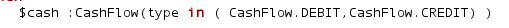
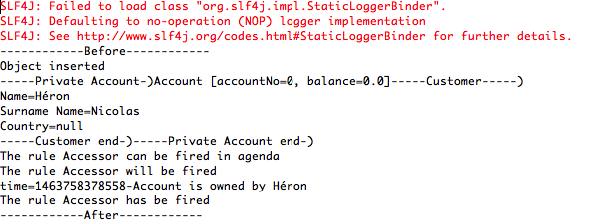

# lesson 3 : Some more drools languages

In lesson 1 et 2, we concentrate on how the rule engine works in the first lesson. In the second lesson, we introduced how to express constraint between facts.
In this lesson, we will concentrate on the available constraint in the drools language.
The reader has to create a test classes called TestLesson3 like for lesson2.

## Some more classes
To be able to see some more advanced features, we are goig to add 2 new classes in src/main/java droolscours package.

```
package droolscours;

public class Customer {
    private String name;
    private String surname;
    private String country;

    public Customer(String name, String surname, String country) {
        super();
        this.name = name;
        this.surname = surname;
        this.country = country;
    }

    public Customer() {
        super();
        // TODO Auto-generated constructor stub
    }

    public String getCountry() {
        return country;
    }

    public void setCountry(String country) {
        this.country = country;
    }

    public String getName() {
        return name;
    }

    public void setName(String name) {
        this.name = name;
    }

    public String getSurname() {
        return surname;
    }

    public void setSurname(String surname) {
        this.surname = surname;
    }

    @Override
    public String toString() {
        StringBuffer buff = new StringBuffer();
        buff.append("-----Customer-----)\n");
        buff.append("Name=" + this.name + "\n");
        buff.append("Surname Name=" + this.surname + "\n");
        buff.append("Country=" + this.country + "\n");
        buff.append("-----Customer end-)");
        return buff.toString();
    }

}
```

```
package droolscours;

public class PrivateAccount extends Account {
    private Customer owner;

    public Customer getOwner() {
        return owner;
    }

    public void setOwner(Customer owner) {
        this.owner = owner;
    }

    @Override
    public String toString() {
        StringBuffer buff = new StringBuffer();
        buff.append("-----Private Account-)");
        buff.append(super.toString());
        if (this.owner != null) {
            buff.append(this.owner.toString());
        }
        buff.append("-----Private Account end-)");
        return buff.toString();
    }
}

```


## In Constraint
This allows to validate an attribute is a list of values

```
package cours

//#list any import classes here.
import droolscours.CashFlow;
import util.OutputDisplay;
//#declare any global variables here
global OutputDisplay showResult;

rule "The cashFlow can be a  credit or a debit"

	when
		$cash :CashFlow(type in ( CashFlow.DEBIT,CashFlow.CREDIT) )

	then
		showResult.showText("The cashFlow is a credit or a debit");
end
```

```
    @Test
    public void testInConstrait() throws Exception {
        sessionStatefull = KnowledgeSessionHelper
                .getStatefulKnowledgeSessionWithCallback(kieContainer, "lesson31-session");
        OutputDisplay display = new OutputDisplay();
        sessionStatefull.setGlobal("showResult", display);
        CashFlow cashFlow = new CashFlow();
        cashFlow.setType(CashFlow.CREDIT);
        sessionStatefull.insert(cashFlow);
        sessionStatefull.fireAllRules();
    }
```
And the console should look as follows : 


## Nested Accessor

This allows to add a constraint to a attribute class without the need to add the linked object to the session.

```
rule "Accessor"
	when
		$cash :PrivateAccount( owner.name =="Héron" )
	then
		showResult.showText("Account is owned by Héron");
end
```

```
    @Test
    public void testNestedAccessor() throws Exception {
        sessionStatefull = KnowledgeSessionHelper
                .getStatefulKnowledgeSessionWithCallback(kieContainer, "ksession-lesson3");
        OutputDisplay display = new OutputDisplay();
        sessionStatefull.setGlobal("showResult", display);
        Customer customer = new Customer();
        customer.setName("Héron");
        customer.setSurname("Nicolas");
        PrivateAccount pAccount = new PrivateAccount();
        pAccount.setOwner(customer);
        sessionStatefull.insert(pAccount);
        sessionStatefull.fireAllRules();
    }
```
As seen here, we do not add the customer instance to the drools session.



The rule has been fired.


## And/or

```
rule "infixAnd"
	when
	  ( $c1 : Customer ( country=="GB") and  PrivateAccount(  owner==$c1))
		    or
       ( $c1 : Customer (country=="US") and PrivateAccount(  owner==$c1))
	then
		showResult.showText("Person lives in GB or US");
end
```
```
   @Test
    public void testInOrFact() throws Exception {
        sessionStatefull = KnowledgeSessionHelper
                .getStatefulKnowledgeSessionWithCallback(kieContainer, "ksession-lesson3");
        OutputDisplay display = new OutputDisplay();
        sessionStatefull.setGlobal("showResult", display);
        Customer customer = new Customer();

        customer.setCountry("GB");
        sessionStatefull.insert(customer);
        PrivateAccount pAccount = new PrivateAccount();
        pAccount.setOwner(customer);
        sessionStatefull.insert(pAccount);
        sessionStatefull.fireAllRules();
    }
```


## not

## exist

## ForAll

## From

## counting

## Summing


