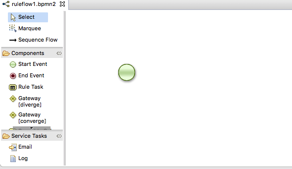
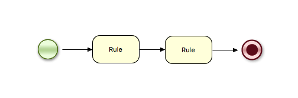
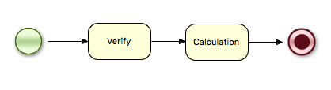
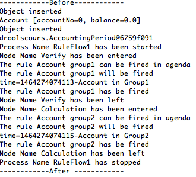
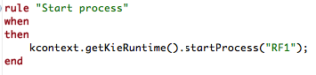
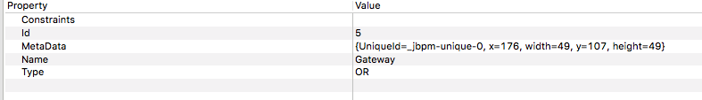
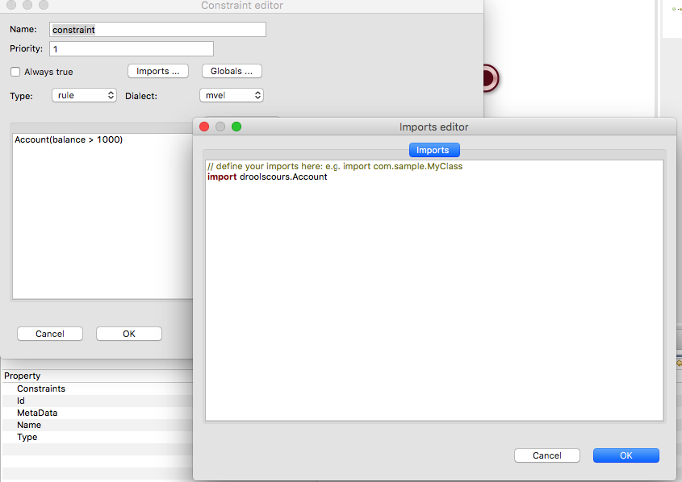

# Organizing rule execution for bigger projects

## Why do we need a Ruleflow ?
When capturing business requirements, most users express the rules by dividing the problem to resolve in steps. As this, it is very convenient to be able to implement it the same way. 
In the drools/jbpm technology, we are going to use a jbpm process by using rule steps, it is then called a rule flow. But in reality, we can mix jbpm/drools together.


## Configure project to become a jbpm project

select the project, right click with the mouse configure/convert to jbpm project


## Create your first rule flow

in the src/test/rules create a package lesson4. Right click and create new File and call it ruleflow1.bpmn2 and click the OK button. An error messages appear to say the file is empty but the plugin will create a start event.




put two Rule tasks and one End Event.




Then select each of the Rule set and set the properties as follows : 


The workflow should look like that : 


Select the workflow in the rear, and in the properties file, change as follows : 


Create a new rule file called demo-ruleflow1.drl

```
package cours

import droolscours.Account;
import droolscours.AccountingPeriod;
import droolscours.CashFlow;
import util.OutputDisplay;

global OutputDisplay showResult;

rule "Account group1"
	ruleflow-group "Group1"
	when
		Account(  )
	then 
		showResult.showText("Account in Group1");
end
rule "Account group2"
	ruleflow-group "Group2"
	when
		Account(  )
	then 
		showResult.showText("Account in Group2");
end

```
Do not forget to add a new entry in the kmodule.xml

```
     <kbase name="rules4" packages="lesson4">
        <ksession name="ksession-lesson4"/>
    </kbase>

```


Look at the keyword "ruleflow-group". Here the first rule we give it the name "Group1" and the second "Group2". they have the same name as the Rule-flow items we defined in the process definition above. Therefor, the first rule can only be fired when the rule-flow group "Group1" is activated and the same for the second rule and rule-flow group "Group2".
Before running a test case, we will add a new callback to know the activities around the jbpm process.

```
   public static KieSession getStatefulKnowledgeSessionForJBPM(
            KieContainer kieContainer, String sessionName) {
    	  KieSession session = getStatefulKnowledgeSessionWithCallback(kieContainer,sessionName);
        session.addEventListener(new ProcessEventListener() {
			
  			@Override
  			public void beforeVariableChanged(ProcessVariableChangedEvent arg0) {
  				// TODO Auto-generated method stub
  				
  			}
  			
  			@Override
  			public void beforeProcessStarted(ProcessStartedEvent arg0) {
  				System.out.println("Process Name "+arg0.getProcessInstance().getProcessName()+" has been started");
  			  
  				
  			}
  			
  			@Override
  			public void beforeProcessCompleted(ProcessCompletedEvent arg0) {
  				// TODO Auto-generated method stub
  				
  			}
  			
  			@Override
  			public void beforeNodeTriggered(ProcessNodeTriggeredEvent arg0) {
  				// TODO Auto-generated method stub
  				
  			}
  			
  			@Override
  			public void beforeNodeLeft(ProcessNodeLeftEvent arg0) {
 				if (arg0.getNodeInstance() instanceof RuleSetNodeInstance){
  					System.out.println("Node Name "+ arg0.getNodeInstance().getNodeName()+" has been left");		
  				}

  			}
  			
  			@Override
  			public void afterVariableChanged(ProcessVariableChangedEvent arg0) {
  				// TODO Auto-generated method stub
  				
  			}
  			
  			@Override
  			public void afterProcessStarted(ProcessStartedEvent arg0) {
  					
  			}
  			
  			@Override
  			public void afterProcessCompleted(ProcessCompletedEvent arg0) {
  				System.out.println("Process Name "+arg0.getProcessInstance().getProcessName()+" has stopped");
  				
  				
  			}
  			
  			@Override
  			public void afterNodeTriggered(ProcessNodeTriggeredEvent arg0) {
  				if (arg0.getNodeInstance() instanceof RuleSetNodeInstance){
  					System.out.println("Node Name "+ arg0.getNodeInstance().getNodeName()+" has been entered");		
  				}
  			}
  			
  			@Override
  			public void afterNodeLeft(ProcessNodeLeftEvent arg0) {
   			}
  		});
        return session;
    }
 

```
Note that we are only looking for Node of type Rule Step called RuleSetNodeInstance.
And the test case looks like this : 

```
package droolscours;
import util.OutputDisplay;
import org.junit.After;
import org.junit.Before;
import org.junit.BeforeClass;
import org.junit.Test;
import org.kie.api.runtime.KieContainer;
import org.kie.api.runtime.KieSession;
import util.KnowledgeSessionHelper;

@SuppressWarnings("restriction")
public class TestLesson4 {
	static KieContainer kieContainer;
	KieSession sessionStatefull = null;

	@BeforeClass
	public static void beforeClass() {
		kieContainer = KnowledgeSessionHelper.createRuleBase();
	}
	@Before
	public void setUp() throws Exception {
		System.out.println("------------Before------------");
	}
	@After
	public void tearDown() throws Exception {
		System.out.println("------------After ------------");
	}

	@Test
	public void testRuleFlow1() {
		sessionStatefull = KnowledgeSessionHelper
				.getStatefulKnowledgeSessionForJBPM(kieContainer, "ksession-lesson4");
		OutputDisplay display = new OutputDisplay();
		sessionStatefull.setGlobal("showResult", display);
		Account a = new Account();
		sessionStatefull.insert(a);
		sessionStatefull.startProcess("RF1");
		sessionStatefull.fireAllRules();
	}
}
```
Before calling the fireAllRules method, we call a startProcess method with the "RF1" parameter which is the ID we gave to the process above.


And the console display should be like this : 


How a rule-group works ?

A rule flow group works like a separate group of rules. Those who are setting the focus when the rule step is called with the same node id as the ruleflow-group.
When no more rules can be fired, the process can continue to the next node.

We can go further 

## starting a ruleflow from a rule


Let us write the following rule :


And here is the following test case : 


```
	@Test
	public void testRuleFlow2() {
		sessionStatefull = KnowledgeSessionHelper
				.getStatefulKnowledgeSessionForJBPM(kieContainer, "ksession-lesson4");
		OutputDisplay display = new OutputDisplay();
		sessionStatefull.setGlobal("showResult", display);
		Account a = new Account();
		sessionStatefull.insert(a);
		sessionStatefull.fireAllRules();
	}
```


## Rule flow with a condition

It is also possible to execute certain ruleflow-group based on condition that can have the same syntax as a rule constraint. 

Create a new package in src/test/rule and calle it lesson4a. Create a new process file that you can call demo-ruleflow2.bpmn2 and a rule file demo-ruleflow2.drl.

The bpmn process should look like this and give it the id "RF3": 


The left split should be a "diverge Gateway" and the right one a "converge Gateway".
The calculate1 should have a ruleflow called "group1" and the calculate2 "group2".

When clicking on the "diverge gateway", you should select the "OR" type and for the the "converge Gateway" the "XOR".





Now we have to edit each connection 
Here is for "to Node Calculate1". Do not forget to click the "Imports" button  to add the Account class.





"To Node Calculate2".


here is the rule file : 

```
package cours

//#list any import classes here.
import droolscours.Account;
import droolscours.AccountingPeriod;
import droolscours.CashFlow;
import util.OutputDisplay;

global OutputDisplay showResult;

rule "start process"
	when
	then
		kcontext.getKieRuntime().startProcess("RF3");
end

rule "Account group1"
	ruleflow-group "Group1"
	when
		Account(balance > 0  )
	then 
		showResult.showText("Account in Group1 > 1000 ");
		
end
rule "Account group2"
	ruleflow-group "Group2"
	when
		Account(  )
	then 
		showResult.showText("Account in Group2 < 1000");
		
end
```

and the test case

```
	@Test
	public void testRuleFlow3() {
		sessionStatefull = KnowledgeSessionHelper
				.getStatefulKnowledgeSession(kieContainer, "ksession-lesson4a");
		OutputDisplay display = new OutputDisplay();
		sessionStatefull.setGlobal("showResult", display);
		Account a = new Account();
		a.setBalance(2500);
		sessionStatefull.insert(a);
		AccountingPeriod period = new AccountingPeriod();
		sessionStatefull.insert(period);
		sessionStatefull.fireAllRules();

	}
```


if you change the balance to 500, the console should be : 


It is more efficient to have two groups of rules like this instead adding for all rules of 'Group1' the constraint on balance > 1000 and balance <= 1000 for "Group2". Indeed, if the level 1000$ changes you have to modify all rules. And furthermore, if the end user gives your the rule : "first case is when balance is less than 1000$", then the good practice is to implement business rules as they are given. And implementing with a ruleflow will help end users to divide their way of expressing more complex rules. We will see int the exercise how it helps.


