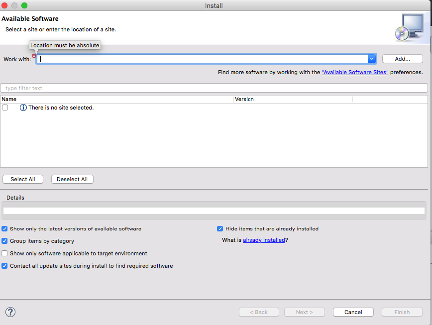

# Organizing rule execution for bigger projects

## Why do we need a Ruleflow ?

## Configure project to became a jbpm project

select the project, right click with the mouse configure/convert to jbpm project

## Create your first rule flow
