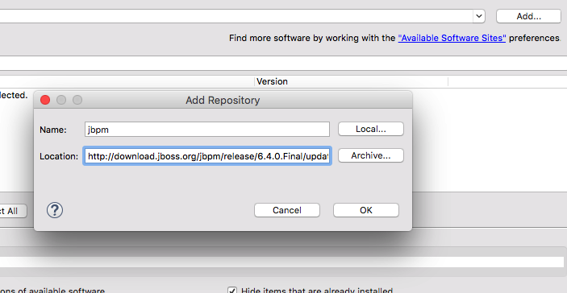

# Organizing rule execution for bigger projects

## install jbpm plugin

To be able to use rule flow, we need to install the jbpm. The update site is [here](http://download.jboss.org/jbpm/release/6.4.0.Final/updatesite/).

In eclipse, help/install new software

push the "Add" button and enter the information as shown : 

##

